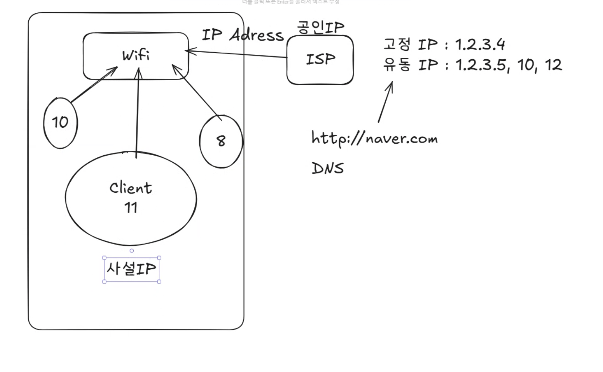

- List를 보면 add() 메서드가 두개가 있는데 하나는 add(E e)이고 리턴타입이 boolean, 하나는 add(int index, E element)이고 리턴타입은 void 이다.
: 다형성, 오버로딩(같은 이름의 함수이지만 파라미터나 리턴타입이 다르게 하는것) 

get(index) -> return E

findById(int id) 함수가 return null이 있는 이유 : 참조형 변수는 초기화를 하지 않으면 null이기 때문. 찾지 못하면 null로 되어있기 때문.

람다표현식 기본 문법
(매개변수) -> {본문}
{.:message}

~~~java
람다표현식 예시
(int a, int b) -> {return a + b;}
~~~

 

~~~xml
<dependencies>
        <!-- https://mvnrepository.com/artifact/mysql/mysql-connector-java -->
        <dependency>
            <groupId>mysql</groupId>
            <artifactId>mysql-connector-java</artifactId>
            <version>8.0.33</version>
        </dependency>

    </dependencies>
~~~
xml 파일은 태그와 트리형태로 되어있는 설정 파일이다.
maven에서 태그만 추가하면 패키지를 자동으로 설치해준다. 위의 코드를 추가해주면 mysql또한 자동으로 설치해준다. 필요한 의존성이나 패키지는 https://mvnrepository.com/에서 찾아서 추가하면 된다.
{:.note.smaller}

~~~java
  private final String url = "jdbc:mysql://localhost:3306/students";
  // Java에서 Mysql 데이터베이스로 접속하기 위한 도메인 정보. localhost는 내 컴퓨터를 의미하고 3306은 mysql의 기본 포트번호이다. students는 데이터베이스 이름이다.
  // localhost = 127.0.0.1
  private final String username = "student";
  private final String password = "1234";
~~~
 
mysql은 기본적으로 3306 포트를 사용한다.
ipconfig를 터미널에 입력해주면 IPv4 주소를 알 수 있다. 이 값은 고유한 값이므로 컴퓨터마다 다 다르다.
ISP(Internet Service Provider) : 인터넷 서비스 제공자. 인터넷 연결을 제공하는 회사. (KT, SKT, LG U+)
가정에서 쓰는 인터넷은 유동 IP를 사용한다. 서버는 고정 IP를 사용한다.

~~~terminal
mysql -u root -p
~~~

터미널에서 mysql root 계정으로 실행하는 명령어이다.
{:.note.smaller}

## 데이터베이스 생성

~~~terminal
CREATE DATABASE students;
~~~

## 계정 조회

~~~terminal
SELECT USER FROM mysql.user;
~~~

## 계정 생성

~~~terminal
create user '계정명'@'%' identified by '패스워드';
~~~

## 권한 부여

~~~terminal
grant all privileges on 테이블명.* to 계정명;
~~~

students 테이블의 모든 권한을 student 계정에 부여하는 명령어이다.
{:.note.smaller}

## 권한 새로고침

~~~terminal
flush privileges;
~~~

