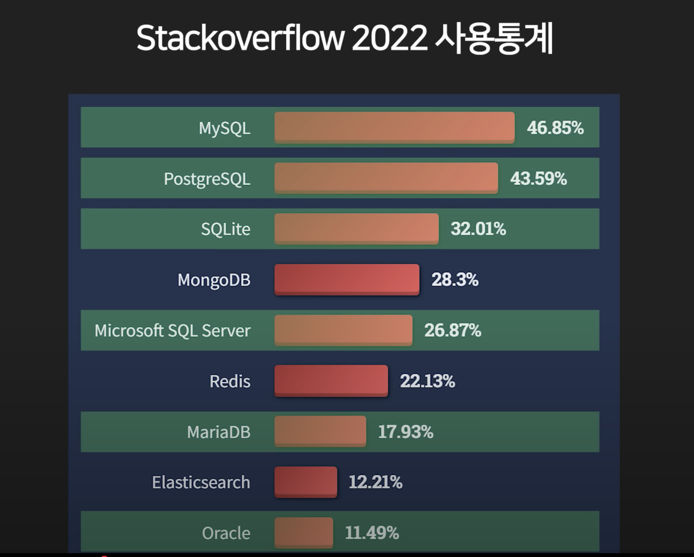
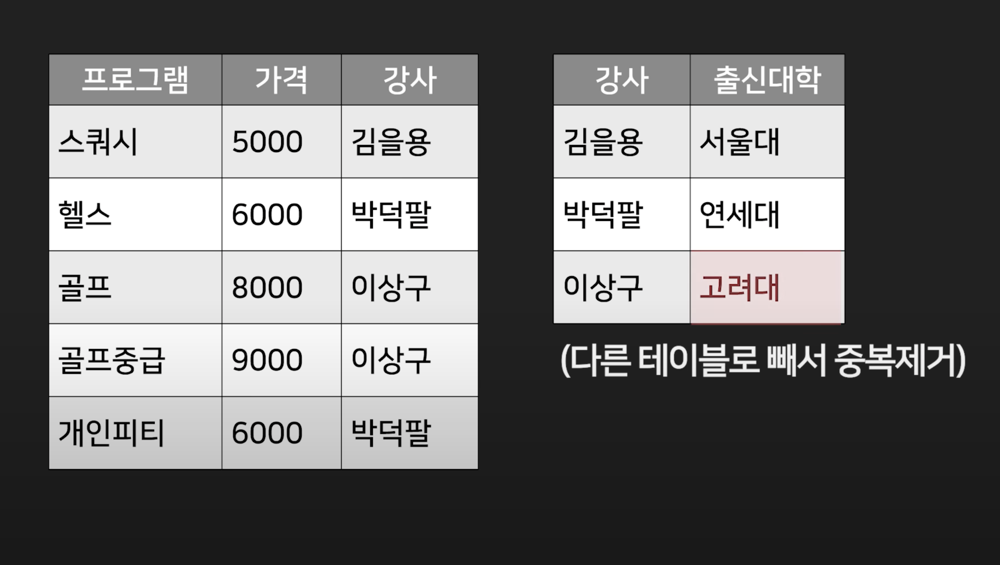

 

## Key-Value Database
 

- 너무 간단해 보여서 쓸모가 없어보이는데 맞다 쓸모가 없다. 서브용 DB로 쓰거나 그게 전부다.
- 그런데 Redis라는 특수한 기능을 가진 Key-Value 데이더베이스가 있다.
 
- 이 친구는 되게 많이쓴다. 데이터를 하드디스크에 저장하지 않고, RAM에 저장을 한다. 왜냐하면 RAM이 하드보다 훨씬 빠르기 때문이다. 물론 하드에 백업은 해둔다. 메인 DB를 두고 사람들이 자주 쓰는 데이터를 redis 에 추가적으로 복사를 해둔다. 그러면 데이터 요청시 메인 DB가 아닌 redis에서 꺼내서 쓰면 속도가 빠르기때문에 효율적이다.
- 자주쓰는 데이터 캐싱, 채팅을 위한 pub/sub, 영상 스트리밍, 로그인 기록 저장 등에 활용한다
- 요즘은 redis 하나로 모든걸 다 할수 있는 redis 업글버전도 있는거 같은데 아무도 안씀

## Relational Database
- 내가 각잡는걸 좋아해서 데이터를 표 형태로 저장하고 싶다? 유구한 역사와 전통의 관계형 데이터베이스를 사용하자.
- 럭키 엑셀임
- 대량의 데이터를 저장하려면 Oracle, MySQL, PostgreSQL등을 사용하는 경우가 많다.
 
- 다양한곳에서 일반적으로 사용할수 있다보니 데이터베이스 점유율을 보면 상위권은 전부 관계형 DB임
 
- 해당 DB에 데이터를 저장하고 싶다? Structed Query Language(SQL)이라는 문법을 이용해야함.
- 쉬워서 세살짜리 애들도 할수 있다고 하는데 안쉬운거 보면 세살보다 어린가봄
- 관계형 DB에서 광적으로 집착하는게 있는데 정규화이다. 보통 데이터를 정규화해서 저장한다.
- 데이터 중복을 너무 싫어해서 데이터가 중복이 된다? 다른 테이블로 다 쪼개버리는 짓을 한다. 이걸 전문용어로 정규화라고 한다.
 
 
- 이것때문에 데이터 입출력하는 문법이 거지같이 될떄가 있다.
- 기본적으로 트랜잭션 기능을 지원해서 돈 거래와 같은 중요한 기능을 구현하고 싶을때 실패시 롤백도 가능하기에 안전하게 구현이 가능하다.
- 그래서 주로 입출력 데이터 속도보다 정확도가 매우 중요하다? 그러면 일반적으로 관계형 데이터베이스를 사용한다.

## Graph Database
- 많은 사람들이 관계형 데이터베이스의 이름떄문에 관계를 잘 표현한다고 생각하는데, 실은 관계라는 표현은 수학 용어중에 Relation 이라는 행렬 배울때 쓰는 용어를 그대로 따와 붙인거다.
- 관계형 데이터베이스는 관계를 중점으로 다루기엔 어려움이 많다.
- 관계를 주로 다루고 싶다? Graph Database를 사용한다.
 
- 가장 유명한게 neo4j
 
- 노드라는걸 만들고 노드 안에 데이터들을 저장할 수 있는데, 노드끼리 어떤 관계인지를 기록할 수 있다.
- 데이터를 입출력할때는 Graph Query Language (GQL)이라는 언어를 이용한다.
- 요거 쓰면 방향도 표현이 가능하다
- 이걸 어디에 쓰냐고? 하면 자료간의 관계, 방향같은걸 중점적으로 저장하고 싶을때 사용. 비행기 노선이나, SNS 친구관계, 코로나전염맵, 대기업 같은경우 추천서비스 이런걸 다룰때 Graph Database 를 사용한다

## Document Database
- "저는 수포자라서 그래프 싫은데요?"
- 일반적인 상황에서 쓰는 DB는 관계형 DB인데 이것보다 조금 더 자유로운게 Document Database이다.
- MongoDB, CouchDB, Firestore 등이 유명함
 
- 예를들면, Collection이라는 폴더를 만들면 그 안에 document라는 파일들을 만들어서 그 파일안에 JSON 형태로 데이터를 저장할 수 있게 되어있다.
- 관계형 DB와 다르게 어떤 데이터를 저장할 지 미리 정의해 둘 필요도 없고, 갑자기 연락처를 추가한다던지 구조가 바뀌어도 문제가 없다.
 
- 정규화따윈 하지 않는다. 그래서 데이터 입출력 문법이 훨씬 간단하다. 
 
- 대부분 분산을 염두해두고 만든 데이터베이스이기 떄문에 데이터베이스를 분산시키는게 매우 쉽다.
- 데이터 입출력이 매우 많은 SNS, 실시간채팅, 게시판, 온라인게임 등에 자주 사용한다.
- 분산하면 물론 단점도 있다. DB간의 정확도가 떨어질 수 있다.

## Column-Family Database
- 나는 관계형 DB와 같이 표 형식으로 저장하고 싶은데 좀 유연하게 쓰고싶다? Column-Family Database 쓰면 됨
 
- 카산드라, 구글의 BigTable 같은게 있다.
 
- 해당 DB들은 똑같이 테이블을 만들고, row를 여러개 만들고 자유롭게 column을 만들어서 데이터를 기입. 행마다 컬럼이 달라도 아무 문제가 없다.
- 데이터 입출력을 할려면 SQL이 아니라 자기들이 만든 언어를 이용해야한다.
- 얘네도 정규화따윈 안한다. 데이터 입출력이 매우 쉽다.
- 복제, 분산 잘함. 그래서 많은 입출력을 감당해야할 때 얘네를 쓰는 경우가 있다.
- Document Database와 마찬가지로 분산하면 단점으로 데이터 정확도(일관성)이 떨어진다.
- 가끔 데이터 저장할 때 시간 기록같은걸 되게 쉽게 해주는 기능이 있어서 시계열 데이터 저장하고 분석할때 이 DB들을 쓰는 경우가 있다. Netflix에서 님 시청기록 이걸로 분석함.

## Search Engine
- 검색용 인덱스를 저장하기 위한 데이터베이스도 존재한다.
 
- 엘라스틱 서치, 아마존 클라우드서치 등이 있다.
- 일반적인 데이터베이스로도 사용이 가능하긴 한데 실제로 그러지는 않음.
- Index 보관용으로 주로 사용함. 인덱스는 데이터의 빠른 검색을 도와주는 색인, 목차라고 생각하면 된다.
- 기존 DB에서 데이터를 뽑아서 여기에 저장을 하면, 인덱스를 생성하고 보관해주는 역할을 한다. 
- 검색 요청이 들어오면 인덱스를 활용해서 자료를 쉽게 검색하게 도와준다.
- 실시간 검색어, 추천 검색어, 검색어 오타교정 과 같은 부가적인 기능들도 쉽게 만들 수 있게 해준다.
- 검색이 중요한 사이트를 만들때 이런걸 쓴다.
 
 

## 3줄요약좀
- 일반적인 용도는 Relations Database, Document Database 둘 중 하나 골라서 쓰면 됨.
- 정확도 필요없고 입출력이 너무 많으면 Document Database, 정확도와 일관성이 중요하면 Relations Database가 일반적
- (확장 방법에 따라 아닐 수도 있음 ㅋ)