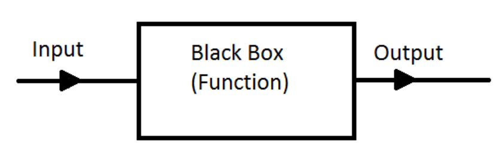
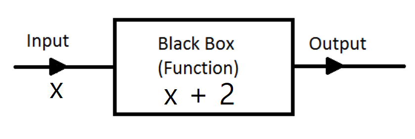

<br>

## <span style="color:#EBE1AB">Arrow Function 문법</span>


자바스크립트에선 함수를 이런 식으로 만들어서 사용한다.

```js
(1)
function 예쁜함수() {
  //어쩌구
}

(2)
var 예쁜함수 = function(){
  //어쩌구
}
```

함수는 (1) 또는 (2) 처럼 만들고<br>
<span style="color:#EBE1AB">예쁜함수();</span> 이렇게 함수를 사용한다.<br>
(function 키워드로 시작하는것 말고도 (2)번처럼 변수에다가 함수를 등호=로 집어넣어서 함수를 만들 수 있다.)<br>
<br>
<br>
<br>
<br>
근데 ES6 신문법을 사용하면 함수를 이렇게 만들 수도 있다.

```js
var 예쁜함수 = () => {
  //어쩌구
}
```

function이라는 길고 복잡한 키워드 대신에<br>
=> 이런 예쁜 화살표를 사용해서 함수를 만들어내는 신문법이다.<br>
그냥 그런게 있구나 하고 외워가면 된다.<br>
근데 외우기 전에 이 문법의 용도를 아는게 중요하다.<br>
<br>
<br>
<br>
<br>
<span style="color:#EBE1AB">왜 쓰냐면 1. 함수 본연의 기능을 아주 잘 표현하는 문법이다.</span><br>
<br>
혹시 프로그래밍 할 때 function 문법은 왜 사용하는지 아는가?<br>
모른다면 지금 당장 외우길 바란다.<br>
<br>
1. 여러가지 기능을 하는 코드를 한 단어로 묶고 싶을 때(그리고 나중에 재사용할 때)<br>
2. 입출력 기능을 만들 때<br>
이럴 때 함수를 써야 한다. 그래야 좋은 프로그래머가 될 수 있다.<br>
<span style="color:#EBE1AB">그리고 arrow function을 사용하면 함수 본연의 </span><span style="color:red">입출력 기능</span><span style="color:#EBE1AB">을 아주 직관적으로 잘 표현해 준다.</span><br>
<br>
<br>

<details>
<summary>입출력 기능이 뭔소리?</summary>
함수가 뭔지부터 보자.<br>
함수는 수학에서 온 개념이다.<br>
원래 함수는 뭐 숫자를 집어넣으면 뭔가 다른 숫자를 배출하는 블랙박스같은 역할을 한다.<br>

<br>위 그림처럼 input을 집어넣으면 output을 출력해주는 박스가 바로 함수다.<br>
<br>
실은 함수개념은 중학교 수학시간에 배운다.<br>
<span style="color:#EBE1AB">문제)f(x) = x + 2 이다. 그럼 f(2)는 뭘까?</span><br>
답은 4이다.<br>
<br>
f(x) 이게 함수다.<br>
아까 박스처럼 그림으로 표현하면 이렇다.<br>

<br>
위에선 x를 집어넣으면 x + 2 를 출력해주는 함수를 만들어 쓰고 있던 것이다.<br>
<br>
<br>
<br>
그럼 프로그래밍에선 어떨까? 2를 집어넣으면 x + 2를 출력해주는 함수를 어떻게 만들어 쓸까? <br><br>

<div markdown="1">
~~~js
function 더해주세요(x){
 return x + 2
}
~~~
</div>
이런 문법을 이용해서 만들어 사용한다.<br>
함수의 소괄호안에는 input역할을 하는 파라미터가 있고<br>
함수내에 return 이라는 것은 output 역할을 하는 키워드이다.<br>
그럼 이제 더해주세요(2); 이렇게 사용하면 4가 이 자리에 남게 되는 것이다.<br>
<span style="color:#EBE1AB">소괄호에 뭔가 집어넣으면 return을 이용해 뭔가 뱉어내는 것</span><br>
이게 바로 함수의 입출력 기능이다.<br>
</details>
<br>
<br>
<br>
그래서 arrow function을 쓰면 입출력기능이 쉽고 예쁘게 표현되지 않나.
<br>

~~~js
var 두배만들기 = (x) => { return x * 2}

console.log( 두배만들기(4) );
console.log( 두배만들기(8) );
~~~
<br>
숫자를 넣으면 2배를 해주는 함수를 하나 만들었다.<br>
함수 표현식 자체가 x가 x * 2가 됩니다~ 라고 말하는것 같은가?<br>
매우 이해하기 쉬워진다.<br>
이게 장점1 이다.<br>
<br>
<br>
<br>
<span style="color:#EBE1AB">왜 쓰냐면 2. 소괄호 생략이 가능하다.</span><br>
<br>
파라미터가 하나라면 소괄호를 생략할 수 있다.<br>

~~~js
var 두배만들기 = x => { return x * 2 }

console.log( 두배만들기(4) );
console.log( 두배만들기(8) );
~~~

이렇게 해도 된다는 소리이다.
<br>
<br>
<br>
<span style="color:#EBE1AB">왜 쓰냐면 3. 중괄호 생략이 가능하다.</span><br>
<br>
중괄호 안에 return 한줄 뿐이라면 중괄호와 return도 생략가능하다.<br>

~~~js
var 두배만들기 = x => x * 2

console.log( 두배만들기(4) );
console.log( 두배만들기(8) );
~~~

생략하니 이제 x가 어떻게 변하는 함수인지 <span style="color:red">입출력기능</span>이 바로 한눈에 들어온다.<br>
원래 {} 중괄호 끝날 땐 세미콜론 안쳐도 잘 되는데<br>
생략할 땐 매너있게 세미콜론은 적어주자.<br>
<br>
<br>
<br>
<br>

## <span style="color:#EBE1AB">Arrow Function 을 쓰면 내부에서 this값을 쓸 때 밖에 있던 this값을 그대로 사용한다.</span><br>
<br>
함수를 쓸때...함수가 쓰인 위치에 따라서 내부의 this값이 변한다고 저번시간에 배웠다.<br>
근데 arrow function은 어디서든 쓰든 간에 내부의 this값을 변화시키지 않는다.<br>
그러니깐 바깥에 있던 this의 의미를 그대로 내부에서도 사용하는 함수가 바로 arrow function이라는 함수이다.<br>
(이게 장점 4이자 arrow function을 쓰는 핵심 이유이다.)<br>
<br>
<br>
<br>
예시를 보자.<br>
<br>

```js
var 오브젝트1 = {
  함수 : function(){ console.log(this) }
}

오브젝트1.함수()
```
위의 코드는 실행하면 무슨 결과가 나올까?<br>
this값을 출력하라고 한다. this가 뭘까?<br>
함수()를 가지고 있는 오브젝트인 오브젝트1이 콘솔창에 출력될 것이다.<br>
<br>
<br>
<br>
그럼 arrow function을 사용하면 어떻게 될까?<br>
<br>

```js
var 오브젝트1 = {
  함수 : () => { console.log(this) }
}

오브젝트1.함수()
```
위의 코드는 실행하면 무슨 결과가 나올까?<br>

<details>
<summary>안알랴줌</summary>
window라는게 출력된다.<br>
여기선 this가 window다.<br>
<br>
<br>
왜 함수의 주인인 오브젝트1이 출력되지 않나면...<br>
this값은 함수를 만나면 항상 변하는데 arrow function 안에서는 변하지 않고 밖에 있던 this를 그대로 쓴다.<br>
(오브젝트 밖에 있던 this는 window이다.)<br>
</details>
<br>
<br>
왜냐면 arrow function은 외부에 있던 this를 그대로 내부로 가져와서 사용하는 함수이기 때문이다.<br>
항상 장점은 아니다. 내가 예측하던 this값과 달라질 수도 있으니 단점이 될 수 있다.<br>
끝이다. 더 알것도 없다.<br>
이제 개발할 때 심심하면 arrow function 열심히 사용하길 바란다.<br>
<br>
하지만 this의 뜻이 달라지는 것 처럼 읿반 function과 용도가 완전 같지 않기 때문에<br>
일반 function을 항상 대체할 수 있는 문법이 아니다. 그것만 주의하자.