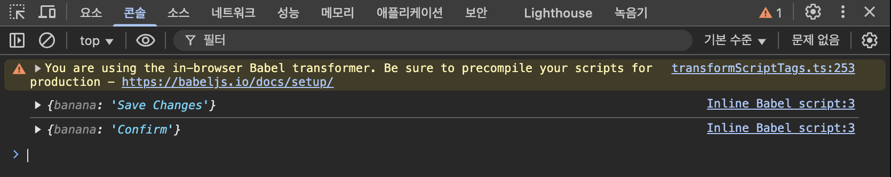
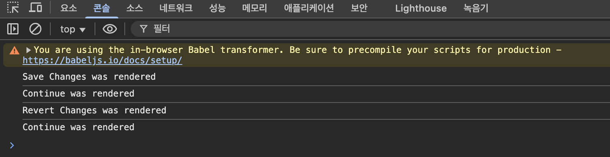
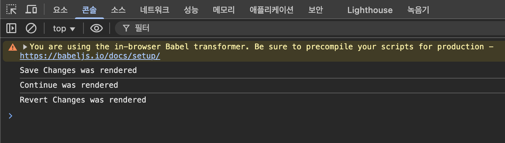

React는 자동으로 내가 넣을 Property(prop)들을 모조리 오브젝트 안에 집어 넣는다. 그리고 해당 오브젝트는 컴포넌트의 첫번째 인자로 주어진다. props가 첫번째이자 유일한 인자이다.
~~~jsx
        const Btn = (props) => {
      console.log(props);
      return <button style={{
        backgroundColor: "tomato",
        color: "white",
        padding: "10px 20px",
        border: 0,
        borderRadius: 10,
      }}>Save Changes</button>;
    };

    const App = () => {
      return(
        

          <Btn banana="Save Changes"/>
          <Btn banana="Confirm"/>
        

      );
      };
~~~

props에 오브젝트가 들어간다. 콘솔을 보면 다음과 같이 나온다.

props에 props.banana객체가 들어간다고 했으므로 아래와 같이 객체 자체를 넣어버릴수도 있다.

~~~jsx
    const Btn = ({banana}) => {
      console.log({banana});
      return <button style={{
        backgroundColor: "tomato",
        color: "white",
        padding: "10px 20px",
        border: 0,
        borderRadius: 10,
      }}>
        {banana}
      </button>;
    };

    const App = () => {
      return(
        

          <Btn banana="Save Changes"/>
          <Btn banana="Confirm"/>
        

      );
      };
~~~

다음과 같이 다른 객체를 추가하는것도 가능하고 삼항연산자를 활용하여 조건문으로 스타일을 줄 수도 있다.

~~~jsx
const Btn = ({text, big}) => {
      console.log({text});
      return <button style={{
        backgroundColor: "tomato",
        color: "white",
        padding: "10px 20px",
        border: 0,
        borderRadius: 10,
        fontSize: big ? 18 : 16,
      }}>
        {text}
      </button>;
    };

    const App = () => {
      return(
        

          <Btn text="Save Changes" big={true}/>
          <Btn text="Confirm"/>
        

      );
      };
~~~

big이 정의되어 있지 않으면 undefined로 뜬다.

~~~jsx
    const App = () => {
      const [value, setValue] = React.useState("Save Changes");
      const changeValue = () => setValue("Revert Changes");
      return(
        

          <Btn text={value} onClick={changeValue} />
          <Btn text="Confirm"/>
        

      );
      };
~~~

onClick은 prop의 이름일 뿐이고 Btn 안으로 전달되고 있는 것이다. HTML에서 넣었다면 이벤트리스너였지만, JSX에서 넣은것이기 때문에 prop이다.

~~~jsx
const Btn = ({text, onClick}) => {
      console.log(text, "was rendered");
      return <button
        onClick={onClick}
        style={{
        backgroundColor: "tomato",
        color: "white",
        padding: "10px 20px",
        border: 0,
        borderRadius: 10,
        fontSize: 16,
      }}>
        {text}
      </button>;
    };

    const App = () => {
      const [value, setValue] = React.useState("Save Changes");
      const changeValue = () => setValue("Revert Changes");
      return(
        

          <Btn text={value} onClick={changeValue} />
          <Btn text="Continue"/>
        

      );
      };
~~~

onClick 이벤트가 자식을 통해 부모의 변경을 발생시키므로 모든 자식 요소들이 re-render 된다.
-> 변경이 없는 요소도 전부 re-render되기에 성능 저하 발생

memo 기능을 사용하면 변경이 없는 요소는 re-render하지 않게 가능하다

~~~jsx
const MemorizedBtn = React.memo(Btn); // memo 기능

    const App = () => {
      const [value, setValue] = React.useState("Save Changes");
      const changeValue = () => setValue("Revert Changes");
      return(
        

          <MemorizedBtn text={value} onClick={changeValue} />
          <MemorizedBtn text="Continue"/>
        

      );
      };
~~~

이렇게 하면 변경이 없는 Continue부분은 re-render가 일어나지 않게 된다.

다음 포스트에서는 Create React App을 사용하여 프로젝트를 생성하고 실행하는 방법에 대해 작성할 예정이다.