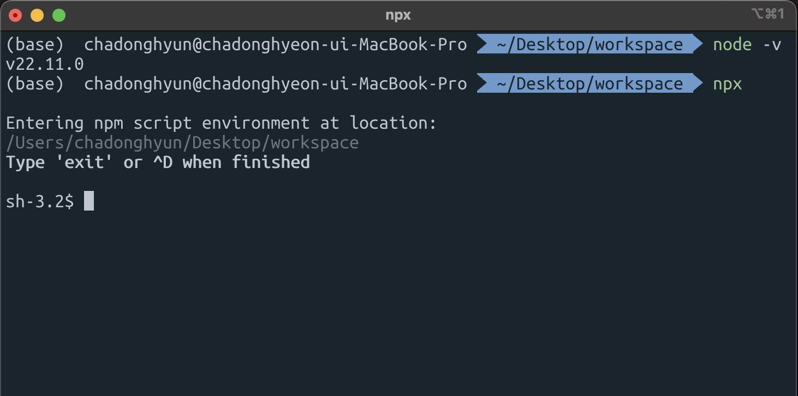
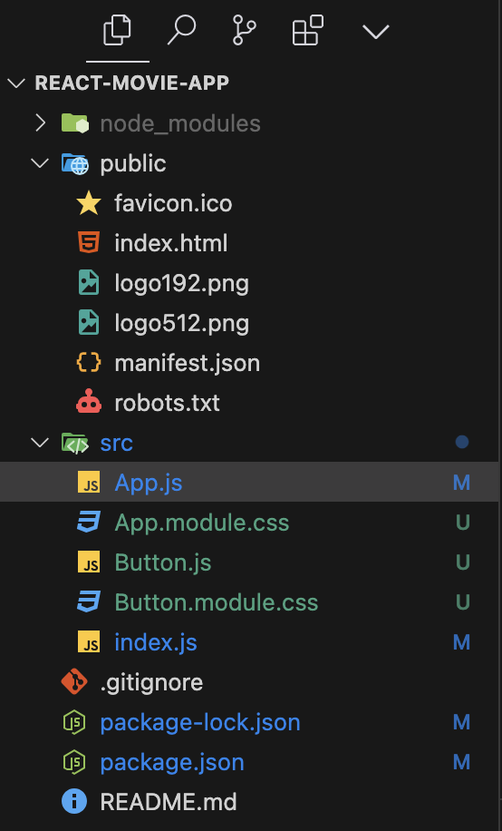

## Create React App 사용하기

Creat React App을 사용하면 ReactJS 어플리케이션을 만들기 훨씬 쉬워진다.

우선 Node.js가 설치되어 있어야하므로 Node.js를 설치해줘야 한다.

~~~terminal
node -v
~~~

설치 후 위의 명령어로 설치가 되었는지 확인 할 수 있다.

npx 명령어를 입력하여 npx 커맨드가 정상적으로 실행되는지도 확인해야 한다.

React 프로젝트를 생성할 폴더로 디렉토리를 이동시킨 후

~~~terminal
npx create-react-app 생성할 프로젝트명
~~~

위의 명령어를 실행해주면 해당 경로에 react 프로젝트를 생성해준다.

생성 후 VSCode로 바로 열어서 보려면

~~~terminal
code 생성한 프로젝트명
~~~

위의 명령어를 실행해주면 된다.

vscode에서 실행 후 터미널에서 npm start를 입력해주면 개발용 서버 (development server)를 만들게 된다.

3300번 포트로 실행되는것을 확인 할 수 있다.

모든 파일들은 src폴더에 있어야 한다. 

구조를 보면 index.js에서 ReactDOM.render이 되기 떄문에 제일 상위 파일이고, public폴더에 생성되어 있는 index.html에 자동으로 넣어서 렌더링 해

주기 때문에 html 파일을 직접 생성해줄 필요가 없다.

하나부터 다 짤 생각이면 index.js와 App.js를 제외하고 전부 지워주면 된다.

~~~css
/* App.module.css */
.title {
    font-family: system-ui, -apple-system, BlinkMacSystemFont, 'Segoe UI', Roboto, Oxygen, Ubuntu, Cantarell, 'Open Sans', 'Helvetica Neue', sans-serif;
    font-size: 18px;
}
~~~

~~~jsx
// App.js
import Button from "./Button"
import styles from "./App.module.css";

function App() {
  return(
    

      <h1 className={styles.title}>Welcome Back!</h1>
      <Button text={"Continue"}/>
    

  );
}

export default App;
~~~
컴포넌트에 css를 적용하고 싶으면 컴포넌트.module.css 라는 파일을 만들고 클래스명을 적용해서 css 스타일을 만들어두면 필요한 곳에서 import하여 필요한 

컴포넌트의 클래스명에 css클래스명을 넣으면 해당 css가 적용되게 되고, render 되었을 때 해당 element 클래스명 뒤에 무작위 난수가 붙게된다. 위의 코드를

보면 이해하기 쉽다.

위의 이미지는 프로젝트 생성 후 폴더 구조를 나타낸 이미지이다.

public 폴더에 있는 index.html 파일은 모든 페이지의 뼈대가 되는 파일이다.

