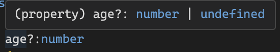
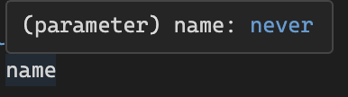

Typescript는 Strongly Typed Language(강타입 언어)이다.   일반적인 컴파일러 언어들은 컴파일 시 어셈블리 코드나 바이트 코드가 되지만, Typescript는 컴파일 하면 Javascript 파일이 생성된다. Web은 Typescript를 이해할 수 없고 Javascript로 이해할 수 있기 때문이다. Node.js는 TS, JS 양쪽 모두 이해할 수 있다.
 
## Typescript는 변수 생성시 변수의 타입을 명시할 수 있다.

~~~ts
let a: number = 1;
~~~

위 코드는 변수 a를 생성할때 타입을 number로 명시해줘야 한다. 만약 다른 타입의 값을 넣으려 한다면 에러를 띄운다.
  

~~~ts
let a: number = 1;
a = “hello”; // 에러
~~~
Typescript는 데이터와 변수의 타입을 명시적으로 정의할 수도 있고 아니면 Javascript처럼 변수만 생성하고 넘어가도 된다. 후자의 방식으로 할 경우 Typescript는 타입을 대입값에 맞추어 추론한다.
  

~~~ts
let a = 1 // 변수만 생성. 대입된 1의 값을 통해 typescript에서 타입을 int로 추론함
let b : string = “abcd” // 변수의 타입을 명시적으로 정의
let c : number[] = [] // 숫자가 들어가는 배열인것을 명시
c.push(1)
~~~

가능한 Typescript가 추론하도록 명시하지 않는편이 편하다.
{:.note.smaller}

  

~~~ts
const player : {
    name:string,
    age?:number
} = {
    name:"piemonte"
}
~~~
age?는 있어도 되고 없어도 된다는 의미이다.
 

~~~ts
type Player = {
    name:string,
    age?:number
} // type alias를 Player로 지정

const playerPiemonte : Player = {
    name:"piemonte"
}

const playerNico : Player = {
    name:"nico",
    age:12
}
~~~

type alias를 지정하면 타입을 재사용할 수 있다.
{:.note.smaller}

  

~~~ts
type Player = {
    name:string,
    age?:number
}

function playerMaker(name:string) : Player {
    return {
        name
    }
}
~~~
playerMaker함수의 파라미터인 name이 string인걸 명시. return값이 Player 타입인것도 명시
  

~~~ts
const nico = playerMaker("nico")
nico.age = 12

type Age = number;
type Name = string;
type Player = {
    name:Name,
    age?:Age
}
~~~
이런식으로 명시도 가능하다.

## readonly

~~~ts
const playerMaker = (name:string):Player => ({name})
const nico = playerMaker("nico")
nico.age = 12

type Player = {
    readonly name:Name, // readonly가 있으면 읽을수만 있고 수정은 불가능하다
    age?:Age
}
~~~

 

~~~ts
const numbers: readonly number[] = [1,2,3,4]
numbers.push(1); // 에러 발생
~~~

## Tuple

Tuple은 Array를 생성할 수 있게 하는데 최소한의 길이를 가져야하고 특정 위치에 특정 타입이 있어야한다.

~~~ts
const player: [string, number, boolean] = ["nico", 2, false]
~~~
이런식으로 array에 string, number, boolean 순으로 저장되는걸 명시해줄 수 있음

자바스크립트에는 readonly나 tuple같은 기능이 존재하지 않는다.
{:.note.smaller}

## Javascript와 동일하게 undefined와 null타입도 존재한다.

~~~ ts
const player : {
    name:string,
    age?:number
} = {
    name:"piemonte"
}
~~~

이전에 봤던 코드인데 여기에 있던 선택적 명시 age?의 정의를 보면 다음과 같이 나온다.

 
age가 number든지 정의되어 있지 않다던지 (undefined) 둘중 하나라는 의미가 된다.

## any

any는 아무 타입이나 될 수 있다. 
변수를 선언할때 타입지정을 하지 않고 초기화를 해주지 않으면 any타입으로 타입추정을 한다. 
any는 Typescript의 보호장치로부터 빠져나오고 싶을때 사용한다. 
typescript 설정에는 any 사용을 막기위해 추가할 수 있는 몇가지 규칙들이 있다. 

any는 쓰지 않는 편이 좋다. typescript를 빠져나오는 것이기 때문에 안전장치를 벗어나는 것이기 때문이다.
{:.note.smaller}

## unknown

어떤 타입인지 모르는 변수는 typescript에게 어떻게 말해줘야 할까? 이때 unknown을 사용한다. 
unknown은 typescript의 보호를 받을 수 있다. 타입을 확인 후에 사용가능하기 때문이다.

~~~ts
let a:unknown;

if (typeof a === ‘number’) {
	let b = a + 1;}
~~~

## void

아무것도 return하지 않는 함수를 대상으로 사용. Typescript가 return하지 않는 함수는 자동으로 void로 인식하므로 따로 지정할 필요 없음.

## never

함수가 절대 return하지 않을때 발생
~~~ts
function hello():never {
    throw new Error("xxx")
}
~~~
에러를 던져줄때는 return하는것이 아니므로 사용가능.
 

타입이 두가지일 수도 있는 경우에도 사용한다.

~~~ts
function hello(name:string|number) {
    if(typeof name === "string"){
        name
    } else if (typeof name === "number") {
        name
    } else {
        name
    }
}
~~~
위 코드에서 else 부분의 name은 string이나 number가 아니기 때문에 never가 된다.

