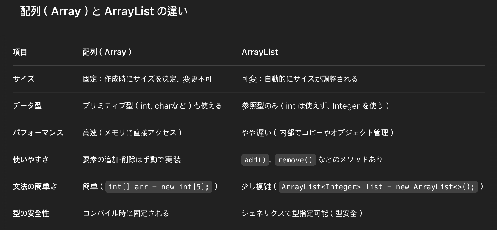
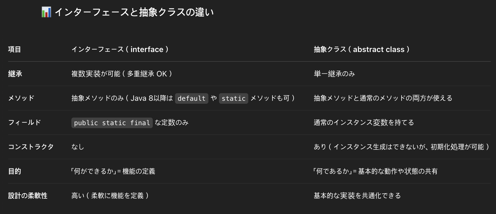
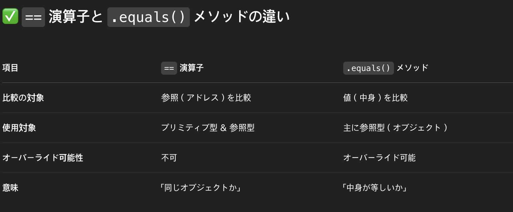
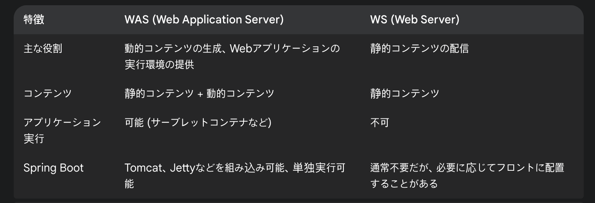
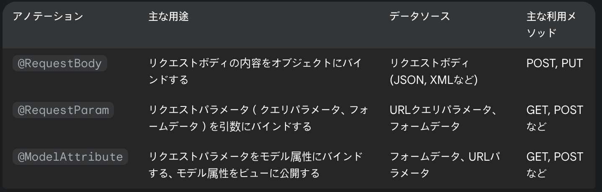

<hr>

## 프로그래밍 공통

### Restful API란?
- RESTful APIは、REST（Representational State Transfer）アーキテクチャに基づいたAPIです。リソースをURIで識別し、HTTP動詞（GET、POST、PUT、DELETE）を使用してリソースを操作します。ステートレスな通信、クライアントサーバー分離、キャッシュ可能性などの特徴があります。

### CORS(Cross-Origin Resource Sharing)
- CORSは、あるオリジン（ドメイン）で実行中のウェブアプリケーションが、異なるオリジンのリソースにアクセスするための仕組みです。セキュリティ上の理由から、ブラウザは同一オリジンポリシーを実装していますが、CORSはこの制限を安全に緩和します。

### 절차지향 프로그래밍과 객체지향 프로그래밍의 차이
- 手続き型プログラミングは、プログラムをタスクの論理的な順序として構成し、関数やプロシージャを使用します。一方、オブジェクト指向プログラミングは、データとそれに対する操作をオブジェクトにカプセル化し、継承、多態性、カプセル化を通じて再利用性と保守性を高めます。

### 대칭키와 비대칭키 암호화 방식
- 対称鍵暗号方式は、暗号化と復号化に同じ鍵を使用します。処理が速いですが、鍵の安全な共有が課題です。非対称鍵暗号方式は、公開鍵と秘密鍵のペアを使用し、一方で暗号化したデータは他方でのみ復号できます。鍵配布の問題を解決しますが、計算コストが高いです。

### TDD(Test Driven Development)의 개념
- TDDは、テストを先に書いてから実装を行う開発手法です。「テスト作成→失敗確認→実装→成功確認→リファクタリング」のサイクルを繰り返します。これにより、要件の明確化、バグの早期発見、保守性の向上などの利点があります。

### 테스트 코드를 작성하는 이유

### MSA(Microservice Architecture)의 장점과 단점
 - 長所
 1. 独立した開発・デプロイが可能
 2. 技術スタックの柔軟な選択
 3. 必要なサービスのみスケーリング可能
 4. 障害の影響範囲を局所化
 5. コードの理解・保守が容易
 - 短所
 1. 分散システム特有の複雑さ
 2. 運用・監視の負担増加
 3. トランザクション管理が困難
 4. サービス間通信によるパフォーマンス低下
 5. 適切なサービス境界設計の難しさ

### 최근에 읽은 기술 관련 책 이름이 무엇이고 인상 깊었던 부분을 얘기해주세요

### 본인이 사용했던 기술들과 그 기술을 사용했던 이유에 대해 설명하고, 대체 기술도 알고 있다면 얘기해주세요

### 비즈니스 로직을 작성할 때 어느 수준으로 작성하는지, 무엇을 중요하게 생각하는지 얘기해주세요

 1. 重視すべき点
 - 可読性と保守性
 - ドメイン知識の正確な反映
 - 責務の明確な分離
 - テスト容易性
 - セキュリティ確保
 2. 実装レベル
 - 単一責任の原則に従う
 - 適切な抽象化レベルを維持
 - ビジネスルールとシステム処理の分離
 - 再利用可能なコンポーネント設計
 - ビジネスロジックはアプリケーションの中核であり、長期的な価値と変更容易性を念頭に設計すべきです。

### 신규 기술을 도입해본 사례가 있으면 얘기해주세요

### 프로젝트를 진행하면서 어려웠던 점이 있었다면 설명해 주세요

### 앞으로 쌓거나 경험하고 싶은 개발자 커리어가 있다면 얘기해주세요


## 자바 프로그래밍

### Java 메모리 구조
- Javaのメモリ構造は主に、ヒープ（オブジェクト格納）、スタック（メソッド呼び出しとローカル変数）、メソッドエリア（クラス情報）、PCレジスタ（実行中の命令アドレス）、ネイティブメソッドスタック（ネイティブコード用）に分かれています。

### Java 프로그래밍 언어의 주요 특징은?

 - プラットフォーム独立性：JVMを通じて「Write Once, Run Anywhere」を実現
 - オブジェクト指向：カプセル化、継承、多態性をサポート
 - 自動メモリ管理：ガベージコレクションによるメモリリーク防止
 - 強力な型システム：コンパイル時の型チェックによる安全性
 - マルチスレッド対応：並行処理の組み込みサポート
 - セキュリティ機能：サンドボックス実行環境など
 - 豊富なライブラリ：標準APIと大規模なエコシステム
 - 堅牢性：例外処理や型安全性による信頼性の高いコード

### Java의 기본 데이터 타입은 무엇이 있나요
 - Javaの基本データ型は8つあります：
  1. 整数型：byte（8ビット）、short（16ビット）、int（32ビット）、long（64ビット）
  2. 浮動小数点型：float（32ビット）、double（64ビット）
  3. 文字型：char（16ビット、Unicode）
  4. 論理型：boolean（true/false）

### Wrapper Class란 무엇이며, Boxing와 UnBoxing의 의미는?
 1. ラッパークラス（Wrapper Class）とは：
 - Javaのプリミティブ型（int、char、booleanなど）をオブジェクトとして扱うためのクラス
 - 例：Integer（int）、Character（char）、Boolean（boolean）、Double（double）など
 - コレクション、ジェネリクス、nullを扱う場合など、オブジェクトが必要な場面で使用

 2. ボクシング（Boxing）：
 - プリミティブ型の値をラッパークラスのオブジェクトに変換する処理
 - 例：int a = 10; → Integer obj = a;

 3. アンボクシング（Unboxing）：
 - ラッパークラスのオブジェクトをプリミティブ型の値に変換する処理
 - 例：Integer obj = 10; → int a = obj;

 4. オートボクシング/オートアンボクシング：
 - Java 5以降で導入された自動変換機能
 - 明示的な変換コードなしに、コンパイラが自動的に変換を行う
 - 例：Integer sum = 10 + new Integer(5);（自動的に変換処理が行われる）
 
### 리플렉션(Reflection)이란
 - リフレクションとは、実行時にプログラムが自分自身のクラス、メソッド、フィールドなどの構造を調査し、操作できる機能です。

 1. 主な特徴：
  - 実行時にクラスの情報（メソッド、フィールド、コンストラクタなど）を取得可能
  - プライベートメンバーへのアクセスも可能
  - クラスをインスタンス化したり、メソッドを動的に実行可能
  - アノテーションの情報を取得できる

 2. 用途：
  - フレームワーク開発（Spring、Hibernateなど）
  - プラグイン機構の実装
  - シリアライゼーション/デシリアライゼーション
  - テストツールやデバッグツール

 3. メリットとデメリット：
  - メリット：動的な処理、高い柔軟性、拡張性
  - デメリット：パフォーマンスの低下、型安全性の喪失、セキュリティリスク

~~~java
Class<?> clazz = MyClass.class;
Method method = clazz.getDeclaredMethod("privateMethod");
method.setAccessible(true);
method.invoke(instance);
~~~

<hr>

### CheckedException와 UnCheckedException의 차이는?
 - CheckedException（検査例外）: コンパイル時に検出される例外
 - UncheckedException（非検査例外）: 実行時に検出される例外

### 객체 지향 프로그래밍의 네 가지 기본 원칙은 무엇인가?
  1. カプセル化：データと操作をオブジェクト内に隠蔽
  2. 継承：既存クラスの特性を新しいクラスに引き継ぐ
  3. 多態性：同じインターフェースで異なる実装を提供
  4. 抽象化：複雑さを隠し、本質的な特性だけを表現

### static 키워드의 사용 예와 그 의미는 무엇인가?
 - staticキーワードは「クラスに属する」という意味を持ち、インスタンス化せずに使用できる要素を定義します。
 
 主な使用例と意味
 1. staticフィールド（クラス変数）
  - 全インスタンスで共有される変数
  - インスタンス生成前にメモリ割り当て
  - クラス名で直接アクセス可能
  ~~~java
   public class Counter {
       public static int count = 0;
   }
   // 使用例: Counter.count++;
  ~~~

 2. staticメソッド（クラスメソッド）
  - インスタンス化せずに呼び出し可能
  - インスタンス変数やメソッドへの直接アクセス不可
  - ユーティリティ関数に適している

  ~~~java
  public static int sum(int a, int b) {
       return a + b;
   }
   // 使用例: int result = MyClass.sum(5, 3);
  ~~~
 3. staticブロック
  - クラスロード時に一度だけ実行される初期化ブロック
  - 静的変数の複雑な初期化に使用
  ~~~java
     static {
       // クラスロード時の初期化処理
   }
  ~~~
 4. staticクラス（内部クラス）
  - 外部クラスのインスタンス化なしで使用できる内部クラス
  - 外部クラスのインスタンスメンバーにアクセス不可
  ~~~ java
  public static class InnerClass {
       // 実装
   }
  ~~~
 5. staticインポート
  - 静的メソッド/フィールドをクラス名なしで使用可能に
  ~~~ java
   import static java.lang.Math.PI;
   // 使用例: double area = PI * radius * radius;
  ~~~

### 가비지 컬렉션(Garbage Collection) 어떻게 작동하는가?
 - ガベージコレクション（GC）は、プログラムの実行中に不要になったオブジェクト（メモリ）を自動的に回収する仕組みです。これにより、メモリリークを防ぎ、効率的なメモリ管理が可能になります。

 代表的なアルゴリズムとしては、以下のようなものがあります：

1. 参照カウント（Reference Counting）
 - 各オブジェクトに参照されている数を保持し、その数がゼロになった場合、自動的にメモリが解放されます。

2. トレース方式（Tracing GC）
 - よく使われるのは「マークアンドスイープ（Mark and Sweep）」方式です。

 まず、ルート（スタックやグローバル変数など）からアクセス可能なオブジェクトを「マーク」します。

 次に、マークされなかったオブジェクトを「スイープ（回収）」します。

3. 世代別GC（Generational GC）
 - オブジェクトの寿命に応じて「ヤング世代」「オールド世代」に分け、それぞれに最適な方法でGCを行います。短命なオブジェクトは頻繁に回収され、長寿命なオブジェクトにはあまりGCがかかりません。

このように、ガベージコレクションはプログラムのパフォーマンスと安定性において非常に重要な役割を果たしています。
 
### 배열과 ArrayList의 차이점은 무엇인가?
 <br>

### try-with-resources 문은 어떤 경우에 사용되나?
- try-with-resources文は、自動的にリソースをクローズする構文です。ファイルやデータベース接続など、close() メソッドが必要なリソースを扱う際に使います。

1. 使用される場面
 - ファイルの読み書き（例：FileReader, BufferedWriter）
 - データベース接続（例：Connection, PreparedStatement）
 - ソケット通信（例：Socket, ServerSocket）
 - その他 AutoCloseable インターフェースを実装しているリソース全般

~~~java
try (BufferedReader reader = new BufferedReader(new FileReader("test.txt"))) {
    String line;
    while ((line = reader.readLine()) != null) {
        System.out.println(line);
    }
} catch (IOException e) {
    e.printStackTrace();
}
// readerは自動的にcloseされる
~~~

2. メリット
 - finallyブロックで明示的にclose()を書く必要がない
 - コードが簡潔になる
 - リソースリーク（閉じ忘れ）を防げる

3. 注意点
 - 利用するリソースは AutoCloseable インターフェースを実装している必要がある
 - Java 7以降で使用可能

### interface와 abstract class의 차이점은 무엇인가?

<br>

- コード例
 1. インターフェースの例：
~~~java
interface Animal {
    void eat();  // 抽象メソッド（実装なし）
}
~~~

 2. 抽象クラスの例：
~~~java
abstract class Animal {
    void breathe() {
        System.out.println("息をする");
    }

    abstract void eat();  // 抽象メソッド（サブクラスで実装が必要）
}
~~~

- 使い分けのポイント
 1. インターフェース：
  - 異なるクラスに共通の「機能だけ」を定義したいとき
  - 例：Comparable, Runnable など

 2. 抽象クラス：
  - 複数のサブクラスに共通の「状態や処理」を定義したいとき
  - 例：Animal という抽象クラスに共通動作をまとめる など

### == 연산자와 .equals() 메서드의 차이점은 무엇인가?
<br>

1. 🔍例：String の場合
~~~java
String a = new String("hello");
String b = new String("hello");

System.out.println(a == b);        // false（違うインスタンス）
System.out.println(a.equals(b));   // true（文字列の内容が同じ）
~~~

- a == b → 参照（メモリ上のアドレス）が異なるため false
- a.equals(b) → 文字列の内容が同じなので true

2. 🔍 基本型（プリミティブ型）の場合
~~~java
int x = 5;
int y = 5;
System.out.println(x == y);  // true
~~~

- int や double などの基本型は == で値の比較が可能です
- .equals() は使えません（基本型はオブジェクトではないため）

### 상속이란 무엇인가?

- 継承（Inheritance）は、オブジェクト指向プログラミングの基本概念の一つで、既存のクラス（親クラス/スーパークラス）の特性（フィールドとメソッド）を新しいクラス（子クラス/サブクラス）に引き継ぐ仕組みです。

1. 継承の主な特徴
 - コードの再利用性: 親クラスのコードを子クラスで再利用できる
 - 階層構造: クラス間の「is-a」関係を表現できる
 - 拡張性: 既存機能を保持しながら新機能を追加可能
 - オーバーライド: 親クラスのメソッドを子クラスで再定義可能

2. Java における継承
~~~java
// 親クラス
public class Animal {
    protected String name;
    
    public void eat() {
        System.out.println("食べる");
    }
}

// 子クラス
public class Dog extends Animal {
    public void bark() {
        System.out.println("吠える");
    }
    
    // オーバーライド
    @Override
    public void eat() {
        System.out.println("骨を食べる");
    }
}
~~~

3. 継承の種類
- 単一継承: Javaでは一つの親クラスのみ継承可能
- 多重継承: 複数インターフェースの実装は可能
- 多階層継承: 継承の連鎖（A→B→Cなど）

4. 継承の利点と注意点
- 利点:
 - コード重複の削減
 - 一貫性のある設計
 - 柔軟な拡張
- 注意点:
 - 強い結合（親クラス変更の影響大）
 - 複雑性の増加
 - 継承の乱用はアンチパターン（継承より合成を検討）


### 오버로딩과 오버라이딩의 차이는 무엇인가?

オーバーロード（Overloading）とオーバーライド（Overriding）は、オブジェクト指向プログラミングにおける重要な概念で、似た名前ですが全く異なる機能を持っています。

1. オーバーロード（Overloading）
 - オーバーロードは、同じクラス内で同じ名前の関数やメソッドを複数定義することです。ただし、パラメータの数や型が異なります。コンパイラは引数の型や数に基づいて、どのメソッドを呼び出すかを決定します。

~~~java
class Calculator {
    int add(int a, int b) {
        return a + b;
    }
    
    double add(double a, double b) {
        return a + b;
    }
    
    int add(int a, int b, int c) {
        return a + b + c;
    }
}
~~~

2. オーバーライド（Overriding）
 - オーバーライドは、親クラスで定義されたメソッドを子クラスで再定義することです。メソッド名、パラメータの型と数は同じですが、実装内容が異なります。これにより、多態性（ポリモーフィズム）を実現します。

~~~java
class Animal {
    void makeSound() {
        System.out.println("動物が鳴きます");
    }
}

class Cat extends Animal {
    @Override
    void makeSound() {
        System.out.println("ニャー");
    }
}
~~~

主な違い

1. 目的：
 - オーバーロード：同じ名前で異なる機能を持つメソッドを提供する（関数多重定義）
 - オーバーライド：親クラスの実装を子クラスで再定義する（関数再定義）


2. 発生場所：
 - オーバーロード：同じクラス内、または親子関係のクラス間
 - オーバーライド：必ず継承関係のあるクラス間


3. シグネチャ：
 - オーバーロード：メソッド名は同じだが、パラメータの型または数が異なる
 - オーバーライド：メソッド名とパラメータの型・数が完全に同じ


4. 戻り値の型：
 - オーバーロード：異なる戻り値の型を持つことができる
 - オーバーライド：同じか、より特化した（派生した）型である必要がある


### 예외 처리에서 try, catch, finally 블록의 역할은 무엇인가?

- try ブロック：例外が発生する可能性のあるコードを囲みます。
- catch ブロック：try ブロック内で発生した特定の例外をキャッチして処理します。複数の catch ブロックを使用して、異なる種類の例外を処理できます。
- finally ブロック：例外が発生してもしなくても、必ず実行されるコードを含みます。通常、リソースのクリーンアップ（ファイルやデータベース接続を閉じるなど）に使用されます。

~~~java
try {
    // 例外が発生する可能性のあるコード
} catch (IOException e) {
    // IOException が発生した場合の処理
} catch (Exception e) {
    // その他の例外が発生した場合の処理
} finally {
    // 必ず実行されるコード
}
~~~

### final, finally, finalize의 차이점은 무엇인가?
- final：変数、メソッド、クラスに使用される修飾子です。
 - final 変数：値を変更できません（定数）
 - final メソッド：オーバーライドできません
 - final クラス：継承できません

- finally：例外処理ブロックの一部で、例外の発生に関係なく実行されます。

- finalize：Java のガベージコレクションにおいて、オブジェクトが回収される前に呼び出されるメソッドです。Java 9以降では非推奨とされています。

### 컬렉션 프레임워크란 무엇인가?
コレクションフレームワークは、データ構造を実装するクラスとインターフェースの集合です。List、Set、Map、Queue などのデータ構造を提供し、データの格納、アクセス、操作のための統一された方法を提供します。主なインターフェースは以下の通りです：

- Collection：基本インターフェース
- List：順序付きコレクション（ArrayList、LinkedList など）
- Set：重複を許さないコレクション（HashSet、TreeSet など）
- Map：キーと値のペアのコレクション（HashMap、TreeMap など）
- Queue：要素を処理する前に保持するコレクション

### HashMap과 HashTable의 차이점은 무엇인가?

1. 同期化：HashTable はスレッドセーフ（同期化されている）ですが、HashMap はスレッドセーフではありません。
2. null 値：HashMap はキーと値に null を許可しますが、HashTable は許可しません。
3. パフォーマンス：同期化のため、HashTable は HashMap より遅い傾向があります。
4. 継承：HashMap は AbstractMap を継承し、HashTable は Dictionary を継承しています。
5. イテレーション：HashMap は fail-fast イテレーターを使用しますが、HashTable の Enumeration はそうではありません。

現代の Java プログラミングでは、同期化が必要な場合は ConcurrentHashMap を使用することが推奨されています。

### 동기화(Synchronization)의 목적은 무엇인가?
同期化の主な目的は、マルチスレッド環境での共有リソースへの安全なアクセスを保証することです。具体的には：

1. スレッドの安全性：複数のスレッドが同時に同じリソースにアクセスすることによる競合状態を防ぎます。
2. データの整合性：複数のスレッドによるデータ破損を防ぎます。
3. 可視性：あるスレッドによる変更が他のスレッドに正確に見えるようにします。
4. アトミック操作：操作が中断されずに完了することを保証します。

### 제네릭(Generic)의 이점은 무엇인가?
1. 型安全性：コンパイル時に型チェックを行い、実行時のエラーを減らします。
2. キャストの排除：手動のキャストが不要になり、ClassCastException の可能性を減らします。
3. コードの再利用性：異なる型で動作する共通のアルゴリズムを実装できます。
4. コードの読みやすさ：コードの意図がより明確になります。
5. パフォーマンス：実行時のキャストチェックが不要になるため、効率が向上します。

~~~java
// ジェネリックの例
public class Box<T> {
    private T content;
    
    public void set(T content) {
        this.content = content;
    }
    
    public T get() {
        return content;
    }
}
~~~

### 동기화 블록(Synchronized Block)과 동기화 메서드(Synchronized Method)의 차이점은 무엇인가?

1. 同期化メソッド：
~~~java
public synchronized void method() {
    // 同期化されたコード
}
~~~
- メソッド全体が同期化されます
- this（インスタンスメソッドの場合）またはクラスオブジェクト（静的メソッドの場合）にロックを取得します

2. 同期化ブロック：
~~~java
public void method() {
    synchronized(lockObject) {
        // 同期化されたコード
    }
}
~~~
- コードの特定の部分のみが同期化されます
- 指定したオブジェクトにロックを取得します

3. 主な違い：
- 粒度：同期化ブロックでは、コードの一部だけを同期化できるため、同期化のオーバーヘッドを減らせます。
- ロックオブジェクト：同期化ブロックでは、任意のオブジェクトをロックとして使用できます。
- パフォーマンス：同期化ブロックは必要な部分だけをロックするため、効率的です。

### Java 8에서 추가된 람다 표현식(Lambda Expression)의 장점과 사용 예는 무엇인가?
- 利点：
 1. 簡潔なコード：匿名クラスよりも短く読みやすいコードになります。
 2. 関数型プログラミング：より宣言的なスタイルのコーディングが可能になります。
 3. 並列処理：Stream API と組み合わせて効率的な並列処理を実装できます。
 4. 遅延実行：処理を必要なときまで遅延させることができます。
 5. コードの再利用性：関数をオブジェクトとして扱えるため、再利用性が向上します。

~~~java
// ラムダ式以前
Collections.sort(list, new Comparator<String>() {
    @Override
    public int compare(String s1, String s2) {
        return s1.compareTo(s2);
    }
});

// ラムダ式を使用
Collections.sort(list, (s1, s2) -> s1.compareTo(s2));

// さらに簡潔に
Collections.sort(list, String::compareTo);

// Stream APIとの組み合わせ
list.stream()
    .filter(s -> s.startsWith("A"))
    .map(String::toUpperCase)
    .forEach(System.out::println);
~~~

### 스트림(Stream) API는 어떤 목적으로 사용되나?
Stream API は、コレクションのデータを宣言的に処理するために使用されます。主な目的と特徴は：

1. 宣言的プログラミング：「何を」行うかを指定し、「どのように」行うかの詳細は抽象化されます。
2. パイプライン処理：複数の操作を連鎖させることができます（filter、map、reduce など）。
3. 並列処理：parallelStream() を使用して、マルチコアプロセッサでの並列実行が容易になります。
4. 遅延評価：終端操作が呼び出されるまで処理は実行されません。
5. 内部反復：外部ループ（for など）の代わりに、内部的にコレクションを反復処理します。
~~~java
List<String> names = Arrays.asList("山田", "田中", "佐藤", "鈴木");

// 名前を大文字に変換し、「田」を含む名前だけをフィルタリングして表示
names.stream()
    .map(String::toUpperCase)
    .filter(name -> name.contains("田"))
    .forEach(System.out::println);
~~~

### Optional 클래스의 목적과 사용법은 무엇인가?

Optional クラスは、null 参照による問題を軽減するためのコンテナオブジェクトです。
- 目的：

 1. NullPointerException の防止：null 参照を明示的に処理することを促します。
 2. より明確なAPI：メソッドが値を返さない可能性があることを明示します。
 3. 機能的な操作：map、filter などの操作を使用して値を変換または処理できます。

- 使用法：
~~~java
// Optional の作成
Optional<String> optional = Optional.of("値");
Optional<String> emptyOptional = Optional.empty();
Optional<String> nullableOptional = Optional.ofNullable(mayBeNullValue);

// 値の取得
String value = optional.get(); // 値がない場合は例外発生
String safeValue = optional.orElse("デフォルト値");
String computedValue = optional.orElseGet(() -> computeValue());
String exceptionValue = optional.orElseThrow(() -> new Exception());

// 条件付き操作
optional.ifPresent(val -> System.out.println(val));

// 値の変換
Optional<Integer> length = optional.map(String::length);

// フィルタリング
Optional<String> filtered = optional.filter(val -> val.length() > 5);
~~~

Optional は特に、null を返す可能性のあるメソッドの戻り値型として使用すると効果的です。これにより、呼び出し元は値の存在を明示的に確認することが促されます。


## 네트워크

### HTTP 프로토콜
 
### HTTP와 HTTPS의 차이점
 - HTTPは平文でデータを送受信するプロトコルで、セキュリティ保護がありません。HTTPSはSSL/TLSによる暗号化を追加し、通信の機密性、完全性、認証を提供します。HTTPはポート80、HTTPSはポート443を使用します。

### 쿠키와 세션의 차이점
 - クッキーはクライアント側に保存される小さなデータで、ブラウザがサーバーにリクエストを送る際に一緒に送信されます。セッションはサーバー側でユーザー情報を保持する仕組みで、通常セッションIDをクッキーに保存してユーザーを識別します。

### TCP와 UDP의 차이
 - TCPは接続指向で信頼性の高いプロトコルです。データの順序保証、エラー検出、再送機能があります。UDPは非接続型で信頼性は低いですが、オーバーヘッドが少なく高速です。リアルタイム性が重要な用途（ストリーミング、ゲームなど）に適しています。

### OSI 7 계층
OSI（Open Systems Interconnection）モデルは、ネットワーク通信のための概念的なフレームワークで、7つの階層に分かれています：

1. **物理層（Physical Layer）**：物理的媒体を通じたビットの伝送を担当。ケーブル、コネクタ、電気信号などが含まれます。

2. **データリンク層（Data Link Layer）**：隣接するノード間の信頼性のある通信を確立。MACアドレスを使用し、フレームの形成と誤り検出を行います。例：イーサネット、Wi-Fi。

3. **ネットワーク層（Network Layer）**：エンドツーエンドの通信経路を確立し、パケットのルーティングを担当。例：IP（インターネットプロトコル）。

4. **トランスポート層（Transport Layer）**：データの信頼性のある転送を保証。例：TCP、UDP。

5. **セッション層（Session Layer）**：アプリケーション間の通信セッションを確立、管理、終了します。

6. **プレゼンテーション層（Presentation Layer）**：データ形式の変換、暗号化、圧縮などを担当。

7. **アプリケーション層（Application Layer）**：ユーザーに直接サービスを提供するプロトコルが含まれます。例：HTTP、FTP、SMTP。

### HTTP Method의 종류

1. **GET**：リソースの取得
2. **POST**：新しいリソースの作成
3. **PUT**：既存リソースの更新（完全な置き換え）
4. **DELETE**：リソースの削除
5. **PATCH**：リソースの部分的な更新
6. **HEAD**：GETと同様だがレスポンスボディなし（ヘッダーのみ）
7. **OPTIONS**：サポートされているHTTPメソッドの確認
8. **TRACE**：リクエストのループバックテスト
9. **CONNECT**：プロキシを介したトンネル接続の確立 

### GET과 POST의 차이

1. **データの送信方法**：
   - GET：URLのクエリパラメータに含める
   - POST：リクエストボディに含める

2. **セキュリティ**：
   - GET：パラメータはURLに表示され、ブラウザ履歴に残る
   - POST：データはボディに含まれるため、URLには表示されない

3. **データ容量**：
   - GET：URLの長さに制限があるため、送信できるデータ量に制限がある
   - POST：理論的には制限なし（実際にはサーバー設定による）

4. **キャッシュ**：
   - GET：キャッシュ可能
   - POST：通常キャッシュされない

5. **冪等性（Idempotency）**：
   - GET：冪等（何度実行しても同じ結果）
   - POST：非冪等（実行するたびに状態が変わる可能性がある）

### 세션 기반 인증과 토큰 기반 인증의 차이점

**セッション基盤認証**：
- サーバーがセッション情報をメモリまたはデータベースに保存
- クライアントはセッションIDをCookieに保存
- リクエストごとにセッションIDを送信し、サーバーで検証

**トークン基盤認証**：
- 認証情報をトークン（JWT等）に暗号化して保存
- クライアントがトークンを保持（通常はローカルストレージ）
- サーバーはステートレスで、トークンの署名を検証するのみ

### Stateful한 세션 기반의 인증 방식의 단점

1. **スケーラビリティの問題**：サーバーがセッション状態を保持するため、水平スケーリングが困難

2. **リソース消費**：多数のユーザーのセッションデータをサーバーで管理すると、メモリ使用量が増加

3. **サーバー障害への対応**：サーバーダウン時にセッション情報が失われる可能性

4. **CORS（クロスオリジン）の問題**：Cookieベースのため、クロスドメイン認証に制限がある

5. **モバイルアプリ互換性**：モバイルアプリでのCookie管理が難しい場合がある

### 세션 기반 인증과 토큰 기반 인증은 어느경우에 적합한가

**セッション基盤認証に適したケース**：
- 単一サーバーまたは小規模なシステム
- セキュリティが最重要の場合（トークンの漏洩リスクが高い環境）
- サーバーサイドでのセッション無効化が必要な場合
- 従来型のWebアプリケーション

**トークン基盤認証に適したケース**：
- マイクロサービスアーキテクチャ
- 分散システム、水平スケーリングが必要な場合
- モバイルアプリケーション
- シングルページアプリケーション（SPA）
- クロスドメインAPIアクセスが必要な場合

### JWT란?

JWT（JSON Web Token）は、JSON形式でエンティティ間で安全に情報を転送するためのオープンスタンダード（RFC 7519）です。

**構造**：
1. **ヘッダー（Header）**：トークンタイプと使用している署名アルゴリズム
2. **ペイロード（Payload）**：クレーム（ユーザーIDなどの情報）
3. **署名（Signature）**：ヘッダーとペイロードの整合性を検証するための署名

**特徴**：
- Base64でエンコードされている
- 自己完結型（トークン自体に必要な情報が含まれる）
- 署名により改ざん検知が可能
- ステートレス認証に適している
- 有効期限を設定可能

### 공인 IP와 사설 IP의 차이

**パブリックIP**：
- インターネット上で一意に識別できるアドレス
- インターネットサービスプロバイダ（ISP）から割り当てられる
- インターネット上で直接アクセス可能
- グローバルに一意で、重複しない
- IPv4の不足により、現在は有限リソース

**プライベートIP**：
- ローカルネットワーク内でのみ使用されるアドレス
- インターネット上では直接ルーティングされない
- 異なるローカルネットワークで同じアドレスが使用可能
- RFC 1918で定義された特定の範囲に限定：
  - 10.0.0.0～10.255.255.255（10.0.0.0/8）
  - 172.16.0.0～172.31.255.255（172.16.0.0/12）
  - 192.168.0.0～192.168.255.255（192.168.0.0/16）

**接続方法**：
プライベートIPを持つデバイスがインターネットにアクセスするには、通常はNAT（Network Address Translation）を使用してパブリックIPに変換します。これにより、複数のデバイスが1つのパブリックIPを共有できます。


## 데이터베이스
### 데이터베이스의 특징
 - インデックスはデータベースのテーブルに対する検索を高速化するデータ構造です。特定のカラムに対して作成され、B木やハッシュ表などの構造を使ってデータへの効率的なアクセスを提供します。検索速度は向上しますが、挿入・更新操作のオーバーヘッドが増加します。

### DDL, DML, DCL

**DDL（Data Definition Language、データ定義言語）**：
データベースの構造を定義するためのSQL文のセットです。テーブル、ビュー、インデックスなどのデータベースオブジェクトの作成、変更、削除に使用されます。

主なDDLコマンド：
- CREATE：データベースオブジェクトを作成
- ALTER：既存のオブジェクトを変更
- DROP：オブジェクトを削除
- TRUNCATE：テーブルのデータを削除（構造は維持）
- RENAME：オブジェクトの名前を変更

**DML（Data Manipulation Language、データ操作言語）**：
データベース内のデータを操作するためのSQL文のセットです。データの検索、挿入、更新、削除などの操作に使用されます。

主なDMLコマンド：
- SELECT：データを検索・取得
- INSERT：新しいデータを挿入
- UPDATE：既存のデータを更新
- DELETE：データを削除
- MERGE：複数の操作（挿入・更新）を一度に実行

**DCL（Data Control Language、データ制御言語）**：
データベースへのアクセス権限とセキュリティを管理するためのSQL文のセットです。

主なDCLコマンド：
- GRANT：権限を付与
- REVOKE：権限を取り消し
- COMMIT：トランザクションを確定
- ROLLBACK：トランザクションを元に戻す
- SAVEPOINT：ロールバックポイントを設定

###트리거란?

トリガーは、特定のイベント（データの挿入、更新、削除など）が発生したときに自動的に実行されるデータベースの手続きです。特定の条件が満たされた場合にのみ実行されるように設定することも可能です。

**トリガーの主な特徴**：
- テーブルやビューにアタッチされる
- INSERT、UPDATE、DELETEなどのDML操作に応答して実行
- BEFORE、AFTER、INSTEADOFなどのタイミングで実行可能
- データの整合性維持、監査ログの作成、複雑なビジネスルールの実装などに使用

**トリガーの例**（PostgreSQL構文）：
```sql
CREATE TRIGGER update_timestamp
BEFORE UPDATE ON customers
FOR EACH ROW
EXECUTE FUNCTION update_modified_column();
```

この例では、customersテーブルが更新される前に、update_modified_column関数が実行されます。

### Index란?

インデックスは、データベーステーブルのデータ検索を高速化するためのデータ構造です。本の索引と同様に、特定のカラム値に基づいて行を素早く見つけるために使用されます。

**インデックスの主な特徴**：
- 検索速度を大幅に向上（特に大規模テーブル）
- 一意性制約の実装に使用可能
- B-Tree、ハッシュ、GiST、GINなど様々な種類がある
- 挿入・更新操作のオーバーヘッドが発生

**インデックスのメリット**：
- SELECTクエリのパフォーマンス向上
- WHERE句の条件検索を高速化
- ORDERBYとGROUPBY操作の効率化
- 一意性制約（UNIQUEとPRIMARY KEY）の保証

**インデックスのデメリット**：
- 追加のディスク容量が必要
- INSERT、UPDATE、DELETEが遅くなる可能性
- 頻繁に更新されるテーブルでは維持コストが高い

**インデックス作成の例**：
```sql
CREATE INDEX idx_customer_name ON customers(last_name, first_name);
```

この例では、customersテーブルのlast_nameとfirst_nameカラムに複合インデックスを作成します。これにより、氏名での検索が高速化されます。

### SQL Injection란?
 - SQLインジェクションは、ユーザー入力を適切に検証せずにSQLクエリに組み込むことで発生する攻撃です。攻撃者は悪意のあるSQLコードを注入し、データベースの不正アクセス、データ漏洩、データ破壊などを引き起こす可能性があります。パラメータ化クエリやORMを使用して防止できます。
 
### ORM 이란

ORMとは、**オブジェクト指向プログラミング言語の世界とリレーショナルデータベースの世界の間の橋渡しをする技術**のことです。

具体的には、プログラムの中で扱うオブジェクトと、データベースのテーブルのレコードを対応付けます。これにより、プログラマーはSQLを直接書くことなく、オブジェクトを操作するだけでデータベースの操作（データの取得、登録、更新、削除など）を行うことができます。

**ORMの主なメリット:**

* **開発効率の向上:** SQLを書く手間が省け、オブジェクト指向の考え方でデータベース操作を行えるため、開発時間を短縮できます。
* **保守性の向上:** SQLがプログラムコードに散らばるのを防ぎ、コードの見通しが良くなります。
* **データベースの移植性:** 特定のデータベースに依存しないコードを書くことが容易になります。ORMによっては、設定を変更するだけで異なるデータベースに対応できます。
* **セキュリティの向上:** SQLインジェクションなどの脆弱性を防ぐための機能が提供されている場合があります。
* **生産性の向上:** ORMフレームワークが、CRUD操作やトランザクション管理などの一般的なデータベース処理を自動化してくれるため、開発者はビジネスロジックに集中できます。

**代表的な ORM フレームワーク:**

様々なプログラミング言語向けに、多くのORMフレームワークが存在します。

### Having과 Where의 차이

HAVING句とWHERE句はどちらもSQLのSELECT文で条件を指定するために使われますが、**適用されるタイミングと対象が異なります**。

#### WHERE句

* **適用タイミング:** データの**グループ化を行う前**
* **対象:** **個々の行**
* **役割:** データベースから読み込む行をフィルタリングします。指定した条件に合致する行のみが次の処理（GROUP BYなど）に進みます。
* **使用できる条件:** 列の値に対する直接的な条件（例：`age > 20`、`name = '山田'`）

**例:**

```sql
SELECT customer_id, SUM(amount)
FROM orders
WHERE amount > 1000  -- 注文金額が1000円より大きい注文のみを対象とする
GROUP BY customer_id;
```

## 스프링, 스프링부트

### WAS(Web Application Server)와 WS(Web Server)의 차이

#### WAS (Web Application Server)

WASは、**Webアプリケーションを実行するためのソフトウェア**です。静的なコンテンツだけでなく、**動的なコンテンツやアプリケーションのロジック**を処理することができます。

**主な役割:**

* **動的コンテンツの生成:** データベースとの連携やビジネスロジックの実行を通じて、HTML、XML、JSONなどの動的なコンテンツを生成します。
* **Webアプリケーションの実行環境の提供:** サーブレットコンテナなどの実行環境を提供し、Java EE (Jakarta EE) などのWebアプリケーション仕様に基づいたアプリケーションを実行します。
* **トランザクション管理、セキュリティ機能の提供:** アプリケーションの信頼性や安全性を高めるための機能を提供します。
* **セッション管理:** ユーザーの状態を管理するための機能を提供します。

**Spring/Spring Bootとの関連:**

Spring Bootでは、Tomcat、Jetty、UndertowなどのWASを**組み込み (embedded)** で利用することが一般的です。これにより、開発者は別途WASをインストール・設定する必要なく、Spring Bootアプリケーションを単独で実行できます。また、WARファイルとして外部のWASにデプロイすることも可能です。

**代表的なWAS:**

* Apache Tomcat
* Jetty
* Undertow
* WebLogic Server
* WebSphere Application Server
* JBoss EAP

#### WS (Web Server)

WSは、主に**クライアントからのHTTPリクエストを受け付け、静的なコンテンツ（HTMLファイル、CSSファイル、JavaScriptファイル、画像など）をクライアントに配信する**ためのソフトウェアです。

**主な役割:**

* **静的コンテンツの配信:** ファイルシステムから要求された静的なファイルをクライアントに送信します。
* **HTTPリクエストの処理:** クライアントからのHTTPリクエストを受け付け、適切なレスポンスを返します。
* **基本的なセキュリティ機能:** アクセス制御などの基本的なセキュリティ機能を提供します。

**Spring/Spring Bootとの関連:**

Spring Bootアプリケーションは、組み込みWASがWeb Serverの機能も兼ね備えているため、通常はWSを別途用意する必要はありません。ただし、より大規模なシステムや特定の要件がある場合には、NginxやApacheなどのWeb ServerをSpring Bootアプリケーションの前に配置し、ロードバランシングやSSL終端などの目的で利用することがあります。

**代表的なWS:**

* Apache HTTP Server
* Nginx
* Microsoft IIS

#### WASとWSの主な違い

<br>

#### まとめ

簡単に言えば、**WSは静的なファイルを配信するサーバー**であり、**WASはそれに加えて動的なコンテンツを生成したり、Webアプリケーションを実行したりする機能を持つサーバー**です。Spring Bootでは通常WASを組み込んで利用するため、Web Serverの役割も兼ね備えています。


### Spring Framework의 특징
 - Spring Frameworkの主な特徴：
  1. DI（依存性注入）とIoC（制御の反転）によるコンポーネント管理
  2. AOP（アスペクト指向プログラミング）によるクロスカッティングコンサーン
  3. 宣言的トランザクション管理
  4. 豊富なモジュール（MVC、Security、Data、Bootなど）
  5. テスト容易性の向上
  6. 他フレームワークとの統合性

### @RequestBody, @RequestParam, @ModelAttirbute의 차이

<br>

### Spring Boot와 Spring Framework의 차이점
 - Spring Bootは、Spring Frameworkの上に構築された拡張で、「設定より規約」の原則に従います。自動設定、組み込みサーバー、スターター依存関係、アクチュエーターなどの機能により、最小限の設定でSpringアプリケーションを素早く構築できます。SpringFrameworkが基盤技術を提供するのに対し、Spring Bootは開発効率と生産性向上に焦点を当てています。

### Spring MVC란?

Spring MVCは Spring Framework の中核となるモジュールの一つで、**Webアプリケーションを構築するためのフレームワーク**です。モデル・ビュー・コントローラー（MVC）デザインパターンを実装しており、アプリケーションの関心を分離し、開発を効率的に進めることを支援します。

**主な構成要素:**

* **DispatcherServlet:** 全ての HTTP リクエストを受け付け、適切なハンドラーに転送するフロントコントローラーの役割を担います。
* **Controller:** クライアントからのリクエストを処理し、モデルデータを準備してビューに渡す役割を担います。 `@Controller` または `@RestController` アノテーションを使用して定義します。
* **Model:** アプリケーションのデータを保持するオブジェクトです。コントローラーで生成され、ビューに渡されます。
* **ViewResolver:** コントローラーから返されたビュー名を基に、実際のビューオブジェクトを生成する役割を担います。
* **HandlerMapping:** 受信したリクエスト URL とマッピングされるコントローラーのメソッドを決定する役割を担います。

Spring MVC は、柔軟で拡張性の高い Web アプリケーション開発のための様々な機能を提供します。

### 제어의 역전(IoC, Inverion of Control)

制御の反転（IoC）とは、**オブジェクトの生成や依存関係の管理を開発者が直接行うのではなく、フレームワークが代わりに行うデザインパターン**です。従来のプログラミングでは、オブジェクトが自身に必要な依存オブジェクトを生成したり、探したりして使用しますが、IoC ではフレームワーク（例：Spring）がオブジェクトの生成と依存性の注入を管理します。

**IoC の利点:**

* **コードの結合度の低下:** オブジェクト間の依存関係が外部から管理されるため、コードの結合度が低くなり、柔軟性が高まります。
* **コードの再利用性の向上:** オブジェクトは必要な依存性を外部から注入されるため、様々な環境で再利用しやすくなります。
* **テスト容易性の向上:** 依存性を簡単にモックオブジェクトに置き換えることができるため、単体テストが容易になります。

Spring Framework は IoC コンテナを提供し、Bean と呼ばれるオブジェクトの生成、ライフサイクル管理、依存性注入などを自動化します。

### 스프링에서 빈을 등록하는 방법

Spring で Bean を登録する方法は主に以下の通りです。

1.  **コンポーネントスキャン（`@Component`, `@Service`, `@Repository`, `@Controller`）:** クラスに `@Component` のようなステレオタイプアノテーションを付与し、Spring の設定でコンポーネントスキャンを有効にすると、Spring コンテナが該当クラスを Bean として自動的に登録します。`@Service`, `@Repository`, `@Controller` は `@Component` の特殊な形式で、各レイヤーの意味を明確に示します。
2.  **`@Bean` アノテーション:** `@Configuration` アノテーションが付与された設定クラス内で、`@Bean` アノテーションを使用して Bean を登録できます。この方法は、外部ライブラリのクラスを Bean として登録したり、Bean の生成ロジックをカスタマイズしたりする場合に便利です。
3.  **XML 設定:** 過去には XML ファイルを使用して Bean を定義する方法が主に使用されていましたが、最近ではアノテーションベースの設定がより多く使用されます。`<bean>` タグを使用して Bean を定義し、属性を通じて依存関係を設定できます。

### 의존성 주입(DI, Dependency Injection)의 방법

依存性注入（DI）とは、**オブジェクトが必要とする依存性（他のオブジェクト）を、オブジェクト自身が生成したり探したりするのではなく、外部から注入される**という考え方です。Spring では主に以下の方法で依存性が注入されます。

1.  **コンストラクタインジェクション（Constructor Injection）:** コンストラクタの引数を通じて依存性を注入する方法です。必須の依存関係を明確に示すことができ、不変性を確保するのに有利です。Spring ではコンストラクタインジェクションを推奨しています。
2.  **セッターインジェクション（Setter Injection）:** セッターメソッドを通じて依存性を注入する方法です。オプションの依存関係を注入したり、オブジェクト生成後に依存関係を変更する必要がある場合に使用されることがあります。
3.  **フィールドインジェクション（Field Injection）:** `@Autowired` アノテーションをフィールドに直接付与して依存性を注入する方法です。コードが簡潔になるという利点がありますが、テストが難しく、オブジェクト間の結合度が高くなる可能性があるため、一般的には推奨されません。

Spring は IoC コンテナを通じて、これらの依存性注入を自動的に処理します。

### 관점지향 프로그래밍(APO, Aspect Oriented Programming)

観点指向プログラミング（AOP）とは、**アプリケーション全体に共通する関心事（横断的関心事、Cross-cutting Concerns）を、コアとなるビジネスロジックから分離してモジュール化するプログラミングパラダイム**です。ロギング、トランザクション管理、セキュリティなどのように、複数の箇所で繰り返し使用される機能を AOP を通じて効率的に管理できます。

**AOP の主要な概念:**

* **Aspect:** 横断的関心事を実装したモジュールです。Spring では、クラスに `@Aspect` アノテーションを付与して定義します。
* **Advice:** Aspect がいつ、どのような方法でコアロジックに影響を与えるかを定義します。`@Before`, `@After`, `@Around` などのアノテーションを使用してメソッドに適用します。
* **Pointcut:** Advice を適用するジョインポイント（Joinpoint）を指定する表現です。
* **Joinpoint:** Advice が適用される可能性のある特定の時点を指します。メソッドの実行、例外のスローなどがジョインポイントになり得ます。

AOP を使用することで、コードの重複を減らし、コアロジックを変更することなく共通機能を追加したり修正したりできるため、保守性が向上します。

### VO, DAO, DTO

VO、DAO、DTO は、アプリケーションのアーキテクチャにおいて、データを管理し、転送するために使用されるデザインパターンです。

* **VO (Value Object):** 値を表現する不変のオブジェクトです。主にデータベースのテーブルの 1 行のデータを格納するために使用されます。値そのものを表現することが目的であるため、セッターメソッドを持たないことが多いです。
* **DAO (Data Access Object):** データベースとのやり取りを担当するオブジェクトです。データベースへの接続、クエリの実行など、データアクセスに関するロジックをカプセル化し、ビジネスロジックからデータアクセス方法を隠蔽します。
* **DTO (Data Transfer Object):** レイヤー間でデータを転送するために使用されるオブジェクトです。例えば、サービスレイヤーからプレゼンテーションレイヤーへデータを渡す際に使用されます。VO とは異なり、可変である場合があり、複数のテーブルのデータを結合したり、特定の画面に必要なデータのみを含んだりすることがあります。
 
### 싱글톤 패턴이란?

シングルトンパターンとは、**クラスのインスタンスが一つしか生成されないことを保証し、そのインスタンスへのグローバルなアクセスポイントを提供するデザインパターン**です。アプリケーション内で唯一のインスタンスであるべきオブジェクト（例：設定マネージャー、ロギングオブジェクトなど）を作成する際に使用されます。

**シングルトンパターンの実装方法:**

* private なコンストラクタを使用して、外部からのインスタンス生成を防ぎます。
* static なメンバ変数を通じて、唯一のインスタンスを保持します。
* static なメソッドを通じて、その唯一のインスタンスへのアクセスを提供します。

Spring Framework で管理される Bean は、デフォルトでシングルトンスコープを持ちます。つまり、Spring コンテナ内でその Bean のインスタンスは一つだけ生成され、共有されます。

### JPA, 마이바티스 등에서 N+1 문제의 의미와 발생하는 이유는?

N+1問題とは、ORM（JPA）やデータマッパー（MyBatis）などを使用する際に発生する**パフォーマンス上の問題**です。主に関連エンティティを持つエンティティのリストをフェッチする際に発生し、**1つのメインクエリを実行した後、関連するエンティティをロードするためにN回追加のクエリが実行される現象**を指します。

**発生理由:**

* **遅延ロード（Lazy Loading）の設定:** 関連エンティティが必要になったときにのみロードするように遅延ロードが設定されている場合、メインエンティティをロードした後、各メインエンティティに関連するエンティティにアクセスするたびに、追加のクエリが実行されます。
* **ORM の動作:** ORM はオブジェクトグラフとしてデータを管理しようとするため、関連データを自動的にロードしようとする場合があります。

**例（JPAの場合）:**

例えば、`Order` エンティティと `OrderItem` エンティティが一対多の関係を持っているとします。全ての注文をフェッチするクエリを実行した後、各注文に紐づく注文アイテムを遅延ロードでアクセスしようとすると、注文の数だけ追加のクエリが `OrderItem` テーブルに対して実行され、合計で N+1 回のクエリが発生します。

**解決策:**

* **早期ロード（Eager Loading）:** 関連エンティティをメインクエリの時点で一緒にロードするように設定します。
* **Fetch Join/Fetch Select (JPA):** JPQL や Criteria API で Fetch Join または Fetch Select を使用して、必要な関連データを一度のクエリで取得します。
* **Batch Size の設定 (MyBatis など):** MyBatis のようなフレームワークでは、一度のクエリで複数の関連データをロードできるように、Batch Size を設定できます。

N+1問題はアプリケーションのパフォーマンスに深刻な影響を与える可能性があるため、注意深く管理し、適切な解決策を適用する必要があります。