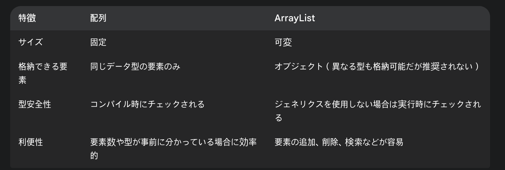
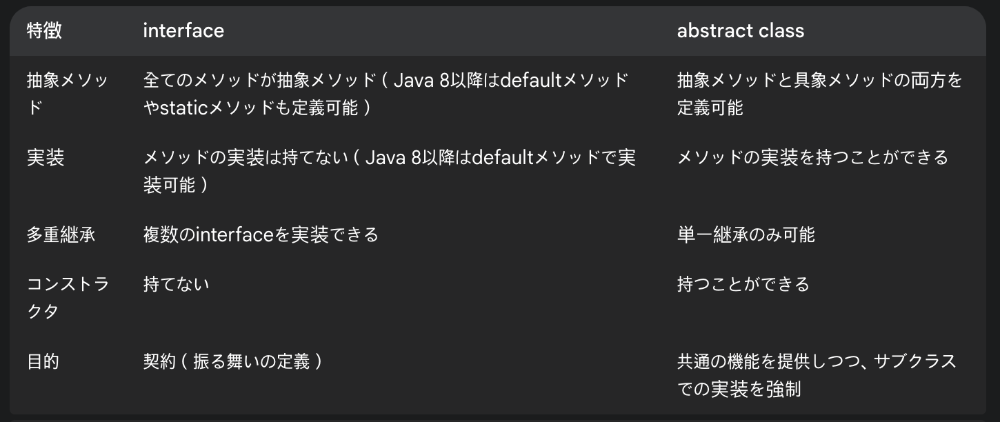
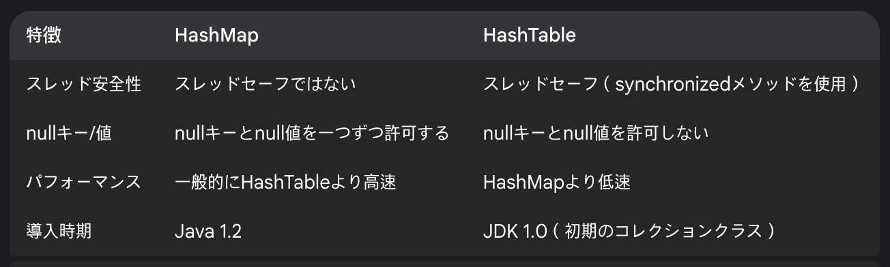
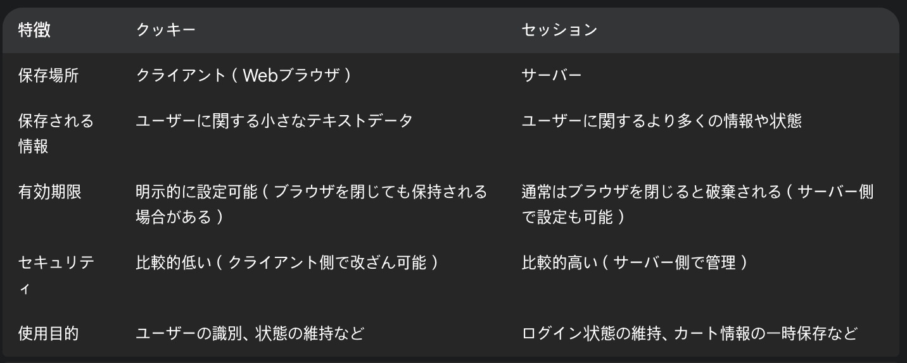
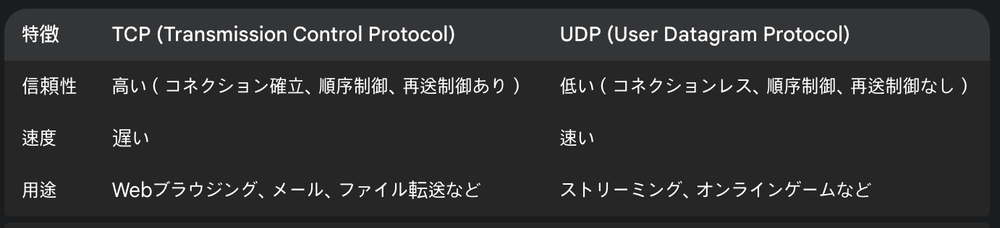
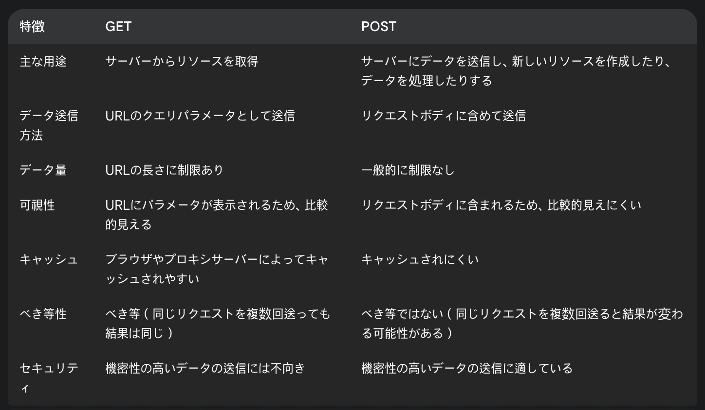
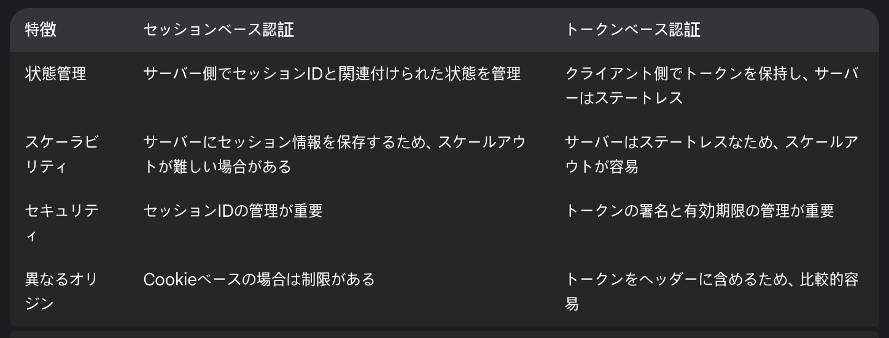
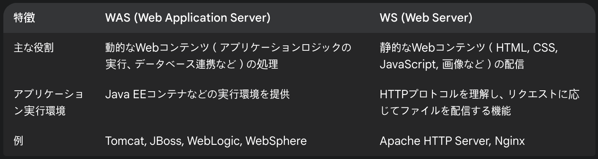
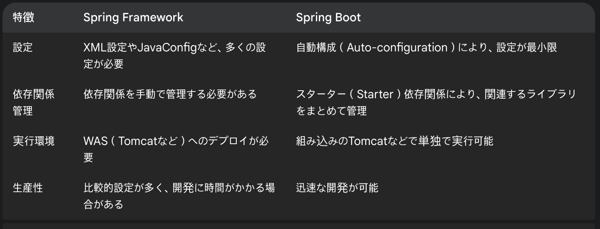

<hr>

## 1. プログラミング共通

- **Restful APIとは？**
  Restful APIとは、Webサービスを構築するための設計原則のセットです。HTTPメソッド（GET, POST, PUT, DELETEなど）を使用してリソースを操作し、ステートレスな通信を行うことを特徴とします。これにより、異なるプラットフォーム間での連携が容易になります。

- **CORS(Cross-Origin Resource Sharing)**
  CORSとは、異なるオリジン（ドメイン、プロトコル、ポート番号の組み合わせ）を持つリソースへのアクセスを制限するセキュリティメカニズムです。通常、Webブラウザは同一オリジンポリシーに従い、異なるオリジンからのリクエストをブロックしますが、CORSを設定することで、特定のオリジンからのアクセスを許可できます。

- **手続き型プログラミングとオブジェクト指向プログラミングの違い**
  手続き型プログラミングは、一連の処理手順を記述することに焦点を当てます。データと処理は分離されており、プログラムは上から順に実行されます。一方、オブジェクト指向プログラミングは、データ（属性）と処理（メソッド）をまとめた「オブジェクト」を中心にプログラムを構成します。これにより、コードの再利用性、保守性、拡張性が向上します。

- **対称キーと非対称キー暗号化方式**
  対称キー暗号化方式では、暗号化と復号化に同じ秘密鍵を使用します。処理速度が速いという利点がありますが、鍵の受け渡しを安全に行う必要があります。一方、非対称キー暗号化方式では、公開鍵と秘密鍵のペアを使用します。公開鍵で暗号化されたデータは、対応する秘密鍵でのみ復号化できます。鍵の受け渡しが容易ですが、処理速度は対称キー方式に比べて遅くなります。

- **TDD(Test Driven Development)の概念**
  TDDとは、テスト駆動開発の略で、実装コードを書く前にテストコードを書く開発手法です。具体的には、「レッド（失敗するテストを書く）→グリーン（テストが成功するように実装する）→リファクタリング（コードを改善する）」というサイクルを繰り返します。これにより、品質の高いコードを効率的に開発できます。

- **テストコードを作成する理由**
  テストコードを作成する主な理由は、以下の通りです。
  * 品質向上: バグを早期に発見し、品質の高いソフトウェアを開発できます。
  * リファクタリングの安全性: コードを変更する際に、既存の機能が壊れていないことを確認できます。
  * 仕様の明確化: テストコードは、コードの動作や期待される振る舞いを明確にする役割も果たします。
  * 開発効率の向上: テストを自動化することで、手動テストの時間を削減し、開発効率を向上させます。

- **MSA(Microservice Architecture)のメリットとデメリット**
  MSAとは、アプリケーションを独立した小さなサービス（マイクロサービス）の集合として構築するアーキテクチャスタイルです。

  **メリット:**
  * 技術的多様性: 各サービスは異なる技術スタックで開発・運用できます。
  * 独立したデプロイ: 各サービスは独立してデプロイできるため、一部の障害が全体に影響を与えにくいです。
  * スケーラビリティ: 各サービスは必要に応じて個別にスケールできます。
  * 開発チームの自律性: 各サービスは独立したチームによって開発・運用できます。

  **デメリット:**
  * 複雑性の増加: サービス間の連携や管理が複雑になります。
  * ネットワーク遅延: サービス間の通信によるオーバーヘッドが発生する可能性があります。
  * 分散トレーシングの困難さ: 複数のサービスにまたがる処理の追跡が難しくなります。
  * 一貫性の維持: 複数のデータベースにまたがるトランザクション管理が複雑になります。

- **最近読んだ技術関連の本の名前と印象深かった部分を話してください**
  （例）最近読んだ技術書は「Domain-Driven Design: Tackling Complexity in the Heart of Software」です。特に印象深かったのは、ドメインエキスパートとの協調を通じて、ソフトウェアのモデルを洗練させていくプロセスです。ユビキタス言語の重要性や、境界づけられたコンテキストの概念は、複雑なビジネスロジックを扱う上で非常に役立つと感じました。

- **本人が使用した技術とその理由、代替技術があれば話してください**
  （例）私は主にJavaとSpring Frameworkを使用してWebアプリケーション開発を行ってきました。Spring Frameworkを選んだ理由は、DI（依存性注入）やAOP（アスペクト指向プログラミング）などの機能が豊富で、エンタープライズレベルのアプリケーション開発に適していると考えたからです。代替技術としては、軽量なフレームワークであるMicronautやQuarkusなども検討できると思います。これらは起動速度が速く、クラウドネイティブな環境に適していると言われています。

- **ビジネスロジックを作成する際、どのレベルで作成するか、何を重要視するか話してください**
  ビジネスロジックを作成する際は、まずビジネス要件を正確に理解することを最も重要視します。その上で、可読性、保守性、拡張性を考慮し、適切なレベルで実装します。具体的には、複雑なロジックはクラスやメソッドに分割し、役割を明確にします。また、テスト容易性を考慮し、外部依存性を少なくするよう心がけます。

- **新規技術を導入した事例があれば話してください**
  （例）以前のプロジェクトで、パフォーマンス改善のためにリアクティブプログラミングを取り入れたことがあります。具体的には、JavaのReactorというライブラリを使用して、非同期処理やイベント駆動型の処理を実装しました。これにより、大量のリクエストを効率的に処理できるようになり、アプリケーションの応答性が向上しました。導入にあたっては、チーム内で学習会を実施し、知識の共有を図りました。

- **プロジェクトを進める上で困難だった点があれば説明してください**
  （例）以前のプロジェクトでは、レガシーシステムとの連携に苦労しました。既存のシステムの仕様が不明確な部分が多く、連携方式も最新の技術とは異なっていたため、調査に多くの時間を費やしました。最終的には、既存システムの担当者と密に連携を取りながら、段階的に連携処理を実装していくことで解決しました。

- **今後、積み重ねたり経験したい開発者としてのキャリアがあれば話してください**
  今後、私はクラウドネイティブな環境での開発経験を深めたいと考えています。具体的には、KubernetesやDockerなどのコンテナ技術や、AWSやAzureなどのクラウドプラットフォームの知識・スキルを習得したいです。また、技術的な専門性を高めるだけでなく、チームをリードできるようなエンジニアを目指したいと考えています。

## 2. Javaプログラミング

- **Javaメモリ構造**
  Javaのメモリ構造は、主に以下の領域に分けられます。
  * ヒープ領域: オブジェクトが生成される領域。ガーベジコレクションの対象となります。
  * スタック領域: メソッドの呼び出しやローカル変数などが格納される領域。スレッドごとに存在します。
  * メソッド領域: クラス情報や静的変数、定数などが格納される領域。
  * ネイティブメソッドスタック: Java以外の言語で記述されたネイティブメソッドの実行に使われる領域。
  * プログラムカウンタレジスタ: 現在実行中の命令のアドレスを保持する領域。スレッドごとに存在します。

- **Javaプログラミング言語の主な特徴は？**
  Javaの主な特徴は以下の通りです。
  * オブジェクト指向: クラスとオブジェクトの概念に基づいたプログラミングが可能です。
  * プラットフォーム非依存性: JVM（Java Virtual Machine）上で動作するため、OSに依存しません。「Write Once, Run Anywhere」という特徴を持ちます。
  * 豊富なAPI: 標準ライブラリが充実しており、様々な機能を利用できます。
  * ガーベジコレクション: メモリ管理を自動で行うため、プログラマが明示的にメモリを解放する必要がありません。
  * マルチスレッド: 複数の処理を同時に実行するマルチスレッドプログラミングが容易です。
  * 高いセキュリティ: バイトコード検証などの仕組みにより、セキュリティが高いとされています。

- **Javaの基本データ型は何がありますか**
  Javaの基本データ型は以下の通りです。
  * 整数型: `byte`, `short`, `int`, `long`
  * 浮動小数点型: `float`, `double`
  * 文字型: `char`
  * 論理型: `boolean`

- **Wrapper Classとは何であり、BoxingとUnBoxingの意味は？**
  Wrapper Classとは、基本データ型をオブジェクトとして扱うためのクラスです。例えば、`int`型のラッパークラスは`Integer`クラスです。

  * **Boxing:** 基本データ型の値を対応するラッパークラスのインスタンスに変換することです。（例：`Integer i = 10;`）
  * **Unboxing:** ラッパークラスのインスタンスから基本データ型の値を取り出すことです。（例：`int value = i;`）

  Java 5以降では、これらの変換は自動的に行われるため、オートボクシング、オートアンボクシングと呼ばれます。

- **リフレクション(Reflection)とは**
  リフレクションとは、実行時にクラスやオブジェクトの情報を取得したり、操作したりする機能です。これにより、コンパイル時には不明だったクラスのメソッドを呼び出したり、フィールドの値を変更したりすることができます。柔軟性の高いプログラミングが可能になりますが、パフォーマンスが低下する可能性があるため、注意が必要です。

- **CheckedExceptionとUnCheckedExceptionの違いは？**
  * **CheckedException:** コンパイル時に例外処理が必須となる例外です。`IOException`や`SQLException`などが該当します。これらの例外が発生する可能性のあるコードは、`try-catch`ブロックで囲むか、メソッドの`throws`句で宣言する必要があります。
  * **UnCheckedException:** コンパイル時には例外処理が強制されない例外です。`RuntimeException`とそのサブクラス（`NullPointerException`, `ArrayIndexOutOfBoundsException`など）や`Error`などが該当します。これらの例外は、プログラマのミスによって発生することが多いため、事前に防ぐことが推奨されます。

- **オブジェクト指向プログラミングの四つの基本原則は何ですか？**
  オブジェクト指向プログラミングの四つの基本原則は以下の通りです。
  * 抽象化
  * カプセル化
  * 継承
  * ポリモーフィズム

- **staticキーワードの使用例とその意味は何ですか？**
  `static`キーワードは、クラスに属するメンバ（フィールドやメソッド）を定義するために使用されます。

  **使用例:**
  * `static int count = 0;` (静的フィールド: クラスのすべてのインスタンスで共有される変数)
  * `static void printMessage(String message) { ... }` (静的メソッド: クラスのインスタンスを作成せずに直接呼び出すことができるメソッド)
  * `static { ... }` (静的イニシャライザ: クラスがロードされる際に一度だけ実行されるブロック)

  **意味:**
  `static`メンバは、クラスの個々のインスタンスではなく、クラス自体に関連付けられます。つまり、クラスのすべてのインスタンスで同じ値を共有したり、インスタンスを作成せずにメソッドを呼び出したりすることができます。

- **ガーベジコレクション(Garbage Collection)はどのように動作しますか？**
  ガーベジコレクションは、Javaのヒープ領域に存在する不要になったオブジェクト（どの変数からも参照されなくなったオブジェクト）を自動的に解放する仕組みです。具体的な動作はJVMの実装によって異なりますが、一般的には以下の手順で行われます。

  1. **マーキング:** どのオブジェクトがまだ使用されているか（reachable）を識別します。
  2. **スイーピング:** 使用されていないオブジェクト（unreachable）をヒープ領域から削除します。
  3. **コンパクション:** 必要に応じて、断片化したメモリ領域を整理し、連続した空き領域を確保します。

  近年のJVMでは、世代別ガーベジコレクションなどのより高度なアルゴリズムが採用されており、効率的なメモリ管理が行われています。

- **配列とArrayListの違いは何ですか？**

<br>

- **try-with-resources文はどのような場合に使用されますか？**
  `try-with-resources`文は、`AutoCloseable`インターフェースを実装したリソース（例えば、ファイルストリーム、データベース接続など）を安全に扱うために使用されます。`try`ブロックを抜ける際に、リソースの`close()`メソッドが自動的に呼び出されるため、明示的にクローズ処理を行う必要がなくなり、リソースリークを防ぐことができます。

- **interfaceとabstract classの違いは何ですか？**

<br>

- **==演算子と.equals()メソッドの違いは何ですか？**
  * **==演算子:**
    * 基本データ型の場合：値が等しいかどうかを比較します。
    * 参照型の場合：メモリ上の参照先（オブジェクトの場所）が同じかどうかを比較します。

  * **.equals()メソッド:**
    * `Object`クラスで定義されており、デフォルトでは`==`演算子と同じ動作をします。
    * 多くのクラス（`String`, `Integer`など）では、オブジェクトの内容（値）が等しいかどうかを比較するようにオーバーライドされています。

- **相続とは何ですか？**
  相続とは、既存のクラス（親クラスまたはスーパークラス）の特性（属性やメソッド）を別の新しいクラス（子クラスまたはサブクラス）が受け継ぐことです。これにより、コードの再利用性が高まり、既存の機能を拡張したり、特殊化したりすることができます。

- **オーバーロードとオーバーライドの違いは何ですか？**
  * **オーバーロード:** 同じクラス内で、メソッド名が同じで引数の型や数が異なるメソッドを複数定義することです。コンパイラは、呼び出し時の引数の情報に基づいて、適切なメソッドを選択します。
  * **オーバーライド:** 親クラスから継承したメソッドを、子クラスで同じ名前、同じ引数の型と数で再定義することです。これにより、子クラスは親クラスのメソッドの動作を独自に変更できます。

- **例外処理でtry, catch, finallyブロックの役割は何ですか？**
  * **tryブロック:** 例外が発生する可能性のあるコードを記述します。
  * **catchブロック:** `try`ブロック内で発生した特定の例外を捕捉し、その例外に対する処理を記述します。複数の`catch`ブロックを記述して、異なる種類の例外を処理できます。
  * **finallyブロック:** 例外が発生しても、しなくても、必ず実行されるコードを記述します。通常、リソースの解放処理などを行います。

- **final, finally, finalizeの違いは何ですか？**
  * **final:**
    * クラスに付与された場合：そのクラスは継承できません。
    * メソッドに付与された場合：そのメソッドはオーバーライドできません。
    * 変数に付与された場合：その変数は一度だけ値を代入でき、その後は値を変更できません（定数）。

  * **finally:** `try-catch`ブロック内で使用され、例外の発生有無にかかわらず、必ず実行される処理を記述するブロックです。

  * **finalize:** `Object`クラスで定義されているメソッドで、ガーベジコレクタによってオブジェクトが破棄される直前に一度だけ呼び出されます。ただし、`finalize`メソッドの動作は予測不可能であり、非推奨とされています。代わりに、`try-with-resources`文や明示的なクローズ処理を使用することが推奨されます。

- **コレクションフレームワークとは何ですか？**
  コレクションフレームワークとは、複数のオブジェクトを効率的に格納、管理するためのクラスやインターフェースの集まりです。Javaのコレクションフレームワークは、`List`（順序あり、重複あり）、`Set`（順序なし、重複なし）、`Map`（キーと値のペア）などの主要なインターフェースと、それらを実装する様々なクラス（`ArrayList`, `LinkedList`, `HashSet`, `HashMap`など）を提供します。

- **HashMapとHashTableの違いは何ですか？**

<br>

- **同期化(Synchronization)の目的は何ですか？**
  同期化の目的は、複数のスレッドが共有リソース（例えば、変数やオブジェクト）に同時にアクセスする際に発生する可能性のある競合状態を防ぎ、データの整合性を保つことです。Javaでは、`synchronized`キーワードや`java.util.concurrent`パッケージのクラスを使用して同期化を実現します。

- **ジェネリック(Generic)の利点は何ですか？**
  ジェネリックの主な利点は以下の通りです。
  * 型安全性: コンパイル時に型チェックが行われるため、実行時の`ClassCastException`などのエラーを未然に防ぐことができます。
  * コードの再利用性: 型パラメータを使用することで、様々な型のオブジェクトを扱うことができる汎用的なクラスやメソッドを作成できます。
  * 可読性の向上: コードを読む際に、どのような型のオブジェクトを扱っているかが明確になり、可読性が向上します。

- **同期化ブロック(Synchronized Block)と同期化メソッド(Synchronized Method)の違いは何ですか？**
  * **同期化メソッド:** メソッド全体を同期化します。メソッドの宣言に`synchronized`キーワードを付与します。これにより、そのメソッドを実行できるスレッドは一つだけになります。
  * **同期化ブロック:** メソッドの一部分だけを同期化します。`synchronized`キーワードと同期化対象となるオブジェクト（通常は`this`または共有オブジェクト）を指定します。これにより、指定されたオブジェクトに対するロックを取得したスレッドだけが、そのブロック内のコードを実行できます。

  一般的に、同期化ブロックの方が同期化の範囲を限定できるため、パフォーマンスの観点からはより柔軟な制御が可能です。

- **Java 8で追加されたラムダ式(Lambda Expression)の利点と使用例は何ですか？**
  ラムダ式の利点は以下の通りです。
  * 簡潔なコード: 匿名内部クラスよりも簡潔に記述できます。
  * 関数型プログラミングのサポート: 関数を第一級オブジェクトとして扱えるようになり、関数型プログラミングのスタイルを取り入れやすくなります。
  * 並行処理の容易化: ストリームAPIなどと組み合わせて使用することで、並行処理をより簡単に記述できます。

  **使用例:**
  ```java
  // 匿名内部クラス
  Runnable runnable1 = new Runnable() {
      @Override
      public void run() {
          System.out.println("Hello from anonymous inner class!");
      }
  };

  // ラムダ式
  Runnable runnable2 = () -> System.out.println("Hello from lambda expression!");

  runnable1.run();
  runnable2.run();
  ```
- **ストリーム(Stream) APIはどのような目的で使用されますか？**
  ストリームAPIは、コレクションなどのデータソースに対して、`filter`（フィルタリング）、`map`（変換）、`reduce`（集約）などの操作をパイプライン処理で行うためのAPIです。主な目的は以下の通りです。
  * 簡潔なコード: 複雑なデータ処理をより簡潔に記述できます。
  * 高いパフォーマンス: 内部的に最適化されており、並行処理も容易に行えます。
  * 遅延評価: 終端操作が実行されるまで中間操作は評価されないため、効率的な処理が可能です。

- **Optionalクラスの目的と使用法は何ですか？**
  `Optional`クラスは、値が存在しない可能性のある変数を扱うためのクラスです。nullチェックを明示的に行う必要がなくなり、`NullPointerException`の発生を抑制することができます。

  **使用法:**
  * 値が存在する場合：`Optional.of(value)`
  * 値が存在しない可能性がある場合：`Optional.ofNullable(value)`
  * 空のOptionalオブジェクトを作成する場合：`Optional.empty()`

  値を取得する際には、`orElse()`, `orElseGet()`, `orElseThrow()`などのメソッドを使用して、値が存在しない場合の処理を指定します。また、`isPresent()`メソッドで値が存在するかどうかを確認することもできます。

## 3. ネットワーク

- **HTTPプロトコル**
  HTTP（Hypertext Transfer Protocol）は、WebブラウザとWebサーバー間で情報をやり取りするためのプロトコルです。クライアント（通常はWebブラウザ）からのリクエストに応じて、サーバーがHTMLファイルや画像などのリソースをレスポンスとして返します。ステートレスなプロトコルであり、リクエストごとに独立して処理が行われます。

- **HTTPとHTTPSの違い**
  HTTPS（Hypertext Transfer Protocol Secure）は、HTTPにSSL/TLS（Secure Sockets Layer/Transport Layer Security）プロトコルを組み合わせて、通信を暗号化することでセキュリティを高めたプロトコルです。これにより、第三者による盗聴や改ざんを防ぐことができます。URLスキームは`http://`ではなく`https://`で始まり、通常は443番ポートを使用します。

- **クッキーとセッションの違い**

<br>

- **TCPとUDPの違い**

<br>

- **OSI 7階層**
  OSI（Open Systems Interconnection）7階層モデルは、ネットワーク通信の機能を7つの階層に分割したモデルです。

  1. 物理層
  2. データリンク層
  3. ネットワーク層
  4. トランスポート層
  5. セッション層
  6. プレゼンテーション層
  7. アプリケーション層

- **HTTP Methodの種類**
  主なHTTPメソッドの種類は以下の通りです。
  * GET
  * POST
  * PUT
  * DELETE
  * PATCH
  * HEAD
  * OPTIONS

- **GETとPOSTの違い**

<br>

- **セッションベース認証とトークンベース認証の違い**

<br>

- **Statefulなセッションベースの認証方式の欠点**
  Statefulなセッションベースの認証方式の主な欠点は以下の通りです。
  * スケーラビリティの課題
  * サーバーのリソース消費
  * ステートフルな依存関係

- **セッションベース認証とトークンベース認証はどのような場合に適しているか**
  * **セッションベース認証:** 比較的小規模なアプリケーションや、サーバー側でユーザーの状態を厳密に管理する必要がある場合（例：ECサイトのカート情報など）。ステートレスな構成にする必要がない場合。
  * **トークンベース認証:** 大規模な分散システムやマイクロサービスアーキテクチャ。モバイルアプリケーションやシングルページアプリケーション（SPA）など、異なるオリジンからのアクセスが多い場合。サーバーのスケーラビリティが重要な場合。

- **JWTとは？**
  JWT（JSON Web Token）は、JSON形式で情報を安全に伝送するためのオープンスタンダードです。主に認証や認可のために使用されます。JWTは、ヘッダー（Header）、ペイロード（Payload）、署名（Signature）の3つの部分で構成されており、Base64エンコードされた文字列として表現されます。サーバーは秘密鍵または公開鍵を使用して署名を検証することで、トークンの信頼性を確認できます。

- **公認IPと私設IPの違い**
  * **公認IP（グローバルIP）:** インターネット上で一意に識別されるIPアドレスです。インターネットに直接接続されたサーバーやルーターなどに割り当てられます。
  * **私設IP（ローカルIP）:** 特定のネットワーク内（家庭内LANや企業内LANなど）でのみ有効なIPアドレスです。ルーターなどによってプライベートネットワーク内で重複しないように割り当てられます。私設IPを持つデバイスがインターネットに接続する際には、NAT（Network Address Translation）などの技術によって公認IPに変換されます。

## 4. データベース

- **データベースの特徴**
  データベースの主な特徴は以下の通りです。
  * データの永続性
  * データの共有性
  * データの独立性
  * データの整合性
  * データの冗長性の排除
  * データのセキュリティ

- **DDL, DML, DCL**
  * **DDL (Data Definition Language):** データベースの構造を定義するための言語です。`CREATE TABLE`, `ALTER TABLE`, `DROP TABLE`などが含まれます。
  * **DML (Data Manipulation Language):** データベースに格納されたデータを操作するための言語です。`SELECT`, `INSERT`, `UPDATE`, `DELETE`などが含まれます。
  * **DCL (Data Control Language):** データベースへのアクセス権限を制御するための言語です。`GRANT`, `REVOKE`などが含まれます。

- **トリガーとは？**
  トリガーとは、データベース内の特定のイベント（例えば、テーブルへのINSERT、UPDATE、DELETE操作など）が発生したときに、自動的に実行されるように定義された一連のSQL文です。データの整合性の維持や監査ログの記録などに使用されます。

- **Indexとは？**
  Indexとは、データベースのテーブル内の特定の列に対して作成されるデータ構造であり、データの検索速度を向上させるために使用されます。書籍の索引と同様に、Indexを使用することで、データベースはテーブル全体をスキャンする代わりに、Indexを参照して目的のデータを効率的に見つけることができます。ただし、Indexを作成すると、データの書き込み（INSERT, UPDATE, DELETE）処理にオーバーヘッドが発生するため、適切なIndex設計が重要です。

- **SQL Injectionとは？**
  SQL Injectionとは、Webアプリケーションなどの入力フォームを通じて、悪意のあるSQLコードをデータベースに注入する攻撃手法です。攻撃者は、意図しないSQLコマンドを実行したり、機密情報を不正に取得したりする可能性があります。対策としては、入力値のサニタイズやプリペアドステートメントの使用などが挙げられます。

- **ORMとは**
  ORM（Object-Relational Mapping）とは、オブジェクト指向プログラミング言語とリレーショナルデータベースの間で、データのやり取りを仲介する技術です。ORMを利用することで、開発者はデータベースのテーブルやレコードをオブジェクトとして扱うことができ、SQLを直接記述する手間を減らすことができます。JavaにおけるHibernateやJPA、PythonにおけるDjango ORMなどが代表的なORMフレームワークです。

- **HavingとWhereの違い**
  `WHERE`句と`HAVING`句はどちらも検索条件を指定するために使用されますが、適用されるタイミングが異なります。
  * **WHERE句:** グループ化（`GROUP BY`句）の前に、個々の行に対して条件を適用します。
  * **HAVING句:** グループ化（`GROUP BY`句）の後に、グループ化された結果に対して条件を適用します。

  つまり、`WHERE`句は行を絞り込むために使用し、`HAVING`句はグループ化された結果を絞り込むために使用します。

## 5. スプリング、スプリングブート

- **WAS(Web Application Server)とWS(Web Server)の違い**

<br>

- **Spring Frameworkの特徴**
  Spring Frameworkの主な特徴は以下の通りです。
  * 軽量かつ強力なフレームワーク
  * IoC/DIコンテナ
  * AOP (Aspect Oriented Programming)
  * トランザクション管理
  * 豊富なモジュール
  * テスト容易性

- **@RequestBody, @RequestParam, @ModelAttributeの違い**
  これらのアノテーションは、Spring MVCコントローラーのメソッド引数で使用され、クライアントからのリクエストデータをバインドするために使用されます。
  * **@RequestBody:** リクエストボディに含まれるJSONやXMLなどのデータをJavaオブジェクトに変換してバインドします。主にPOSTやPUTなどのリクエストで使用されます。
  * **@RequestParam:** URLのクエリパラメータやフォームデータとして送信されたデータをメソッド引数にバインドします。GETリクエストやフォーム送信などでよく使用されます。
  * **@ModelAttribute:** フォームデータやURLパラメータなどを、モデル（Modelオブジェクト）に格納し、Viewで利用できるようにします。通常、フォームの送信処理などで使用されます。

- **Spring BootとSpring Frameworkの違い**

<br>

Spring Bootは、Spring Frameworkの利便性を高め、より簡単にWebアプリケーションやマイクロサービスを開発できるように設計されています。

- **Spring MVCとは？**
  Spring MVCは、Spring FrameworkのWebアプリケーション開発モジュールの一つであり、Model-View-Controller（MVC）デザインパターンを実装するためのフレームワークです。DispatcherServletをフロントコントローラーとして、リクエストのルーティング、ハンドラー（コントローラー）の実行、Viewのレンダリングなどを処理します。

- **制御の逆転(IoC, Inversion of Control)**
  制御の逆転（IoC）とは、オブジェクトの生成や依存関係の解決といった処理を、従来のプログラムコード内で行うのではなく、外部のコンテナ（Spring Frameworkなど）に委譲する設計原則です。これにより、オブジェクト間の依存関係が疎結合になり、コードの柔軟性、再利用性、テスト容易性が向上します。

- **スプリングでBeanを登録する方法**
  SpringでBeanを登録する主な方法は以下の通りです。
  * XML設定 (`applicationContext.xml`など)
  * アノテーション (`@Component`, `@Service`, `@Repository`, `@Controller`など)
  * JavaConfig (`@Configuration`, `@Bean`)

- **依存性注入(DI, Dependency Injection)の方法**
  依存性注入（DI）とは、オブジェクトが使用する他のオブジェクト（依存オブジェクト）を、オブジェクト自身が生成するのではなく、外部から注入（提供）してもらう設計パターンです。Spring Frameworkでは、主に以下の方法でDIを実現します。
  * コンストラクタインジェクション
  * セッターインジェクション
  * フィールドインジェクション

- **観点指向プログラミング(AOP, Aspect Oriented Programming)**
  観点指向プログラミング（AOP）とは、アプリケーションの横断的な関心事（例えば、ロギング、セキュリティ、トランザクション管理など）を、コアとなるビジネスロジックから分離して記述するためのプログラミングパラダイムです。Spring AOPでは、アスペクト（横断的な関心事）、アドバイス（具体的な処理）、ポイントカット（アドバイスを適用する場所）などの概念を用いてAOPを実現します。

- **VO, DAO, DTO**
  これらの用語は、Javaのエンタープライズアプリケーション開発でよく使用されるデザインパターンに関連しています。
  * **VO (Value Object):** 値オブジェクト。エンティティの属性などを表現する不変のオブジェクトです。
  * **DAO (Data Access Object):** データアクセスオブジェクト。データベースなどのデータソースへのアクセスを担当するオブジェクトです。
  * **DTO (Data Transfer Object):** データ転送オブジェクト。異なるレイヤー間でデータを転送するために使用されるオブジェクトです。

- **シングルトンパターンとは？**
  シングルトンパターンとは、あるクラスのインスタンスが一つしか存在しないことを保証するデザインパターンです。グローバルな設定情報やリソース管理など、アプリケーション全体で唯一のインスタンスが必要な場合に利用されます。Spring Frameworkでは、Beanのデフォルトのスコープはシングルトンです。

- **JPA, MyBatisなどでN+1問題の意味と発生する理由は？**
  N+1問題とは、ORM（JPA, MyBatisなど）を使用して関連する複数のエンティティをロードする際に、最初のクエリでN個のエンティティを取得した後、それぞれのエンティティに関連するデータを取得するために追加でN個のクエリが発行されてしまう現象です。

  **発生する理由:**
  遅延ロード（Lazy Loading）の設定がされている場合に、関連エンティティへのアクセスが発生するたびに、追加のSQLクエリが発行されるためです。

  **対策:**
  * Eager Loading
  * Fetch Join
  * Batch Fetch